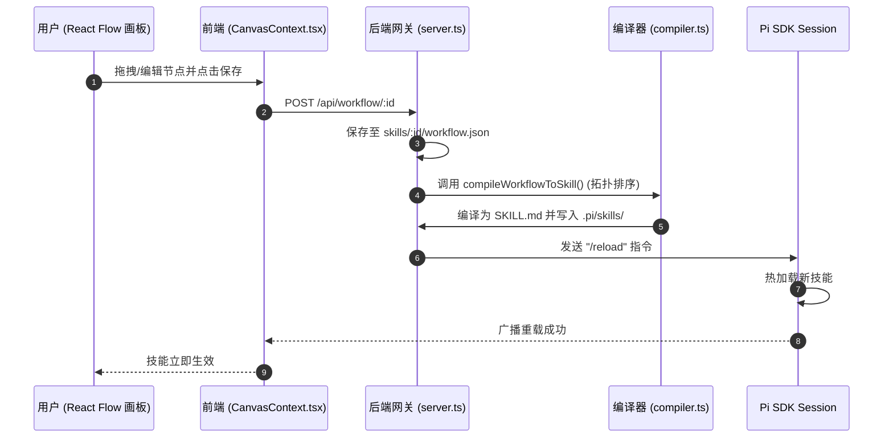
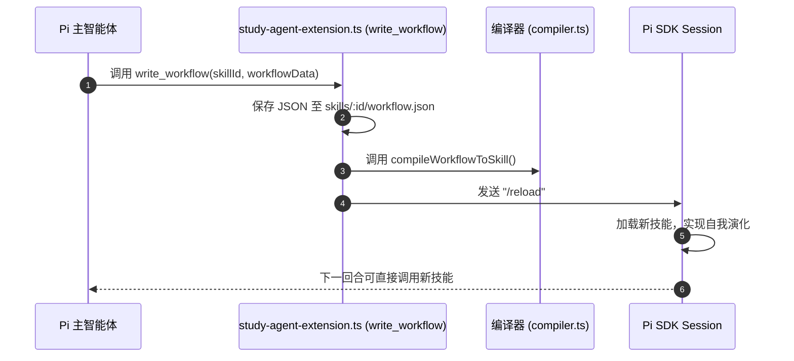
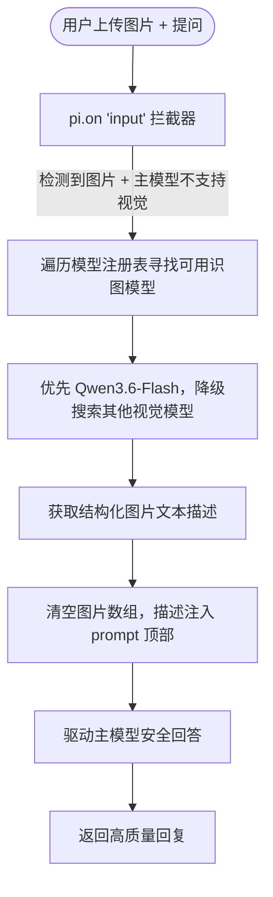

# Snapshot Pi - 基于 Pi Agent 内核的辅助学习智能体系统

[](https://opensource.org/licenses/MIT)
[](https://nodejs.org/)
[](https://reactjs.org/)

`Snapshot Pi` 是一款专为 **开发者与终身学习者** 打造的智能辅助学习系统。它基于 **Pi Agent** 开发套件，深度融合了"启发式教学智能体"、可视化低代码工作流画板（React Flow），并实现了创新的 **双轨遗忘曲线** 常青记忆知识库体系。

---

## 1. 作品介绍与核心目标

### 1.1 项目背景与定位
在信息爆炸的时代，主动学习与知识内化变得愈发困难。普通的笔记软件仅停留在“收集”阶段，而传统的 AI 助手则倾向于直接给出答案，剥夺了学习者主动思考的过程。

`Snapshot Pi` 的定位是 **“第二大脑”与“启发式导师”的结合体**。它不单是一个工具，而是一个陪伴用户成长的学习生态系统。系统通过启发式的对话引导用户深挖概念，并自动将学习成果沉淀到双链知识库中，通过科学的遗忘曲线算法（SM-2）安排复习，实现知识的闭环管理。

### 1.2 核心系统架构
项目采用一体化的多包管理模式，包含以下四个核心功能层：
* **前端交互层 (Frontend)** ：提供多窗口拖拽分栏的卡片式工作区，以及低代码工作流画布。
* **后端网关层 (Backend)** ：提供统一的数据服务和多会话管理，并利用 Socket.io 实现高实时性的双向消息流。
* **智能体内核 (Pi SDK)** ：驱动智能体的逻辑编排、工作流技能动态编译与热重载。
* **移动辅助端 (QQ Bot)** ：通过嵌入式协议适配器（NapCat）实现与个人 QQ 账号的绑定，提供随时随地的移动端对话、自测与学习监控。

---

## 2. 团队分工与开发成果

### 2.1 团队成员与分工
为保障项目在前端视觉、AI 内核、学习闭环等维度上全面推进，4 名团队成员的分工及各模块的开发状态如下：

| 团队成员 | 负责领域 | 具体开发任务 | 完成状态 |
| :--- | :--- | :--- | :---: |
| **李佳骏** | **AI 交互与核心算法** | 启发式交互逻辑与 prompt 注入机制 | ✅ 已完成 |
| | | 指数衰减与 SM-2 复习算法 | ✅ 已完成 |
| | | 多供应商大模型适配器 | ✅ 已完成 |
| | **系统集成与质量保障** | 低代码拓扑编译器 (工作流 → 技能) | ✅ 已完成 |
| | | 多环境自适应对齐工具 | ✅ 已完成 |
| **苏雨<br>唐韵哲** | **后端业务与消息网关** | QQ Bot 适配：限流、心跳、公式渲染 | ✅ 已完成 |
| | | 会话与预设管理后端逻辑 | ✅ 已完成 |
| | | 自测题库生成与 XP 统计 | ✅ 已完成 |
| | | 数据统计与学习周报导出 | ✅ 已完成 |
| **何予畅** | **前端界面与可视化交互** | React Flow 画布节点与 AI 协写 | ✅ 已完成 |
| | | 流式 Markdown 渲染 | ✅ 已完成 |

> *注：四人共同承担代码开发工作，每人聚焦不同维度，协同推进项目。

### 2.2 开发里程碑
目前项目已经完成了 **核心骨架搭建与功能闭环**。
实现了系统的脚手架搭建、后端网关服务、Pi Agent 内核交互、基于 SQLite 风格的本地 JSONL 多会话管理、双链知识库算法基础（SM-2 / 指数置信度衰减）、可视工作流技能编译与热重载、 **画布 AI 协写配置** ，以及基于 NapCat 的 QQ Bot 机器人核心服务（含自测答题系统、周报生成）。

---

## 3. 部署指南

### 3.1 环境要求
- **操作系统** ：Windows 10+ （NapCat QQ Bot 功能需要，独立模式运行，无需管理员权限）
- **Node.js** >= 18.0.0
- **npm** >= 9.0.0

### 3.2 首次部署
1. 克隆项目到本地：
   ```bash
   git clone <repo-url> && cd snapshot-pi
   ```
2. 运行一键初始化脚本进行部署：
   ```bash
   scripts\setup.bat
   ```
   *该脚本会自动完成：环境检查、`npm install` 安装所有依赖、API Key 交互式配置向导、NapCat 依赖自动下载解压，以及前端静态资源编译。*

### 3.3 日常启动
双击运行项目根目录下的启动脚本，或命令行运行：
```bash
start.bat
```
*启动后，后端服务（端口 `3000`）将自动运行，且会自动在您的默认浏览器中打开系统主页 `http://localhost:3000`。*

### 3.4 配置 API 密钥与模型
项目支持多种模型服务商，您可以通过两种方式配置密钥：
1. **Web 界面配置（推荐）** ：启动系统后，点击左下角的 ⚙️ 齿轮按钮，在滑出的设置面板中填写 API Key 和 Base URL，点击保存即可，配置文件会自动存入本地 `.pi/auth.json`。
2. **环境变量配置** ：在启动服务前，设置相应的系统/用户环境变量：

| 服务商 | 环境变量 | 官方 Base URL | 适用模型示例 |
|:---|:---|:---|:---|
| **DeepSeek** | `DEEPSEEK_API_KEY` | `https://api.deepseek.com` | DeepSeek V4 Pro / Flash |
| **Qwen (DashScope)** | `QWEN_API_KEY` | `https://dashscope.aliyuncs.com/compatible-mode/v1` | Qwen3.6 Plus / Flash / Max |
| **Anthropic** | `ANTHROPIC_API_KEY` | `https://api.anthropic.com` | Claude Sonnet 4.6 / Haiku 4.5 |
| **Google** | `GOOGLE_API_KEY` | `https://generativelanguage.googleapis.com/v1beta` | Gemini 2.5 Flash / Pro |

> **Qwen API 配置提示** ：使用通义千问模型，需前往 [阿里云百炼平台](https://bailian.console.aliyun.com/) 获取 API-KEY。请确保您已在百炼平台的 **“模型广场”** 中手动开启了所需模型的授权，否则 API 会报错。

### 3.5 端口分配
| 服务 | 默认端口 |
| :--- | :---: |
| 后端 API 服务（Express + Socket.io，内置静态托管前端） | 3000 |
| QQ WebSocket 服务（NapCat 连接） | 3001 |
| NapCat 本地 WebUI 监控后台 | 6099 |

---

## 4. 使用指南
### 3.6 QQ Bot 移动端部署

#### 3.6.1 前置条件
- NapCat 已通过 scripts\setup.bat 自动部署（首次部署会自动完成）
- 一个可用的 QQ 账号（建议使用小号）

#### 3.6.2 配置 QQ 账号
编辑 config/qq-bot-config.json：

\`\`\`json
{
  "enabled": true,
  "napcat": {
    "path": "napcat/napcat.bat",
    "templateDir": "config/napcat-templates",
    "qqAccount": 123456789
  },
  "triggerKeywords": ["@bot", "/ai", "/ask"],
  "groupSync": {
    "enabled": true,
    "allowedGroupIds": [111111]
  }
}
\`\`\`

> qqAccount 和 allowedGroupIds 需要换成你自己的值。qqAccount 可选，不填也能用。

#### 3.6.3 首次登录
1. 启动系统（start.bat 或 npm run dev）
2. 打开浏览器访问 http://localhost:3000
3. 进入 QQ Bot 选项卡，点击启动
4. 页面显示二维码后，用手机 QQ 扫码授权
5. 授权成功后状态变为 healthy，即可在群内通过 @bot 或 /ai 触发

#### 3.6.4 自动恢复（可选）
设置环境变量后，NapCat 可在会话过期时自动用密码重新登录：

\`\`\`
# Windows CMD
set QQ_BOT_PASSWORD=你的QQ密码

# Windows PowerShell
\$env:QQ_BOT_PASSWORD = "你的QQ密码"
\`\`\`

> 首次仍需扫码登录建立设备信任，后续重启会话过期时可自动恢复。

#### 3.6.5 群聊配置
在 config/qq-bot-config.json 的 allowedGroupIds 中添加群号即可让 Bot 响应群消息。

#### 3.6.6 登录逻辑
\`\`\`
启动 -> spawn 传 -q QQ号 -> bat %%* 转发 -> node.exe
  +-- 缓存会话有效 -> 快速登录成功
  +-- 会话过期 -> NAPCAT_QUICK_PASSWORD -> 登录成功
  +-- 都失败 -> 弹二维码等待扫码
\`\`\`

### 4.1 Web UI 核心功能卡片
系统主页包含四个核心工作区卡片，您可以通过左侧边栏自由切换和拖拽布局：
1. **AI 对话（Chat）** ：与您的专属学习智能体互动。支持流式 Markdown 输出和直接拖入/上传图片。
2. **工作流画布（Canvas）** ：React Flow 可视化技能画布。拖拽并连接控制节点，可一键将其编译成 SKILL.md 文件并热重载到智能体中。
3. **双轨知识库（Knowledge）** ：管理整理笔记和 Wiki 卡片，查看其置信度变化，或在此处管理归档与复习任务。
4. **QQ Bot 监控面版** ：一键启停 QQNT 协议服务，扫码登录，查看答题记录与自测数据。

### 4.2 知识库使用与学习检索
* **常青记忆检索** ：当您在聊天卡片提问时，后端会自动匹配知识库中的 Wiki 卡片或整理笔记内容，并静默注入到 Agent 会话上下文中。命中时系统会显示 `已检索并注入 N 条知识库上下文`。
* **低代码沉淀** ：您可以在画布中配置“写入知识库”节点，在自动化流程执行完后将特定高价值信息沉淀进知识库。

### 4.3 QQ 移动辅助端使用
1. **启动服务** ：进入 Web UI 的 **QQ Bot 卡片** ，点击页头 **▶ 启动** 。
2. **扫码登录** ：在后端命令行窗口中会出现生成的登录二维码，使用手机 QQ 扫码即可登录绑定。
3. **私聊对话与触发** ：
   - 私聊发送消息，Bot 会使用 Pi Agent 智能回复。
   - 数学公式会自动被渲染为美观的 KaTeX 图片，长内容会自动被分段，便于在手机端阅读。
   - 使用 `/ai <问题>` 或 `/ask <问题>` 强制触发 AI。
   - 后台会自动提取高频或高价值的对话内容，生成 Wiki 卡片存入您的常青知识库中。
4. **QQ 端自测与学习指令** ：
   - `/quiz start`：启动一轮针对您置信度较低知识点的 AI 自动出题测试。
   - `/quiz stop`：终止当前测试。
   - `/stats`：查看您的 XP 经验值打卡积分与错题统计。
   - `/help`：获取全部命令帮助。

---

## 5. 核心系统特性与完成进度

系统目前核心功能已全部完成与闭环：

| 模块 | 功能 | 状态 | 代码位置 |
|:---|:---|:---:|:---|
| **基础框架** | Monorepo workspaces 管理 | ✅ 已完成 | `package.json` |
| | start.bat 一键启动 | ✅ 已完成 | `start.bat` |
| | scripts/setup.bat 一键初始化部署 | ✅ 已完成 | `scripts/setup.bat` |
| **前端 WebUI** | 卡片式多窗口拖拽布局 (Workspace) | ✅ 已完成 | `Workspace.tsx`, `WorkspaceContext.tsx` |
| | 苏格拉底流式交互聊天 (Socket.io) | ✅ 已完成 | `ChatCard.tsx`, `ChatContext.tsx` |
| | 多会话创建/切换/删除 | ✅ 已完成 | `ChatContext.tsx`, `server.ts` |
| | 智能体预设 (苏格拉底导师 / 代码专家) | ✅ 已完成 | `agent-presets.json`, `Sidebar.tsx` |
| | 模型选择与 API 凭证配置 | ✅ 已完成 | `SettingsPanel.tsx` |
| **Pi 工作流** | React Flow 可视化画板 | ✅ 已完成 | `CanvasCard.tsx`, `CanvasContext.tsx` |
| | workflow.json → SKILL.md 编译器 (拓扑排序) | ✅ 已完成 | `compiler.ts` |
| | write_workflow 自我修改与热重载 | ✅ 已完成 | `study-agent-extension.ts` |
| **多模态** | Qwen-VL 识图拦截与 prompt 增强 | ✅ 已完成 | `study-agent-extension.ts` |
| **双轨知识库** | 指数衰减置信度引擎 C(t)=C₀e^(-λt) | ✅ 已完成 | `knowledge-base-service.ts` |
| | Layer 3 Wiki 卡片 CRUD (概念/临时/归档) | ✅ 已完成 | `knowledge-base-service.ts` |
| | SM-2 间隔重复笔记复习 | ✅ 已完成 | `knowledge-base-service.ts` |
| | 归档审查 (Lint + Veto + 链接重写) | ✅ 已完成 | `ArchiveReview.tsx` |
| | REST API + Socket.io 实时同步 | ✅ 已完成 | `knowledge-routes.ts` |
| | Agent 自动检索知识库并注入上下文 | ✅ 已完成 | `agent-context.ts`, `server.ts`, `ChatContext.tsx` |
| | 置信度徽章 (绿/黄/红/灰) | ✅ 已完成 | `ConfidenceBadge.tsx` |
| **QQ Bot** | NapCat WebSocket 桥接 + AI 消息处理 | ✅ 已完成 | `qq-adapter.ts` |
| | Markdown→QQ 纯文本转换 | ✅ 已完成 | `qq-adapter.ts` |
| | LaTeX 公式渲染 (Puppeteer + KaTeX) | ✅ 已完成 | `qq-renderer.ts` |
| | 个人对话知识提取 → 知识库卡片 | ✅ 已完成 | `qq-chat-refiner.ts` |
| | 个人自测系统 (AI 出题 + 个人学习反馈) | ✅ 已完成 | `qq-quiz-service.ts` |
| | 个人学习分析 + 薄弱知识点整理 | ✅ 已完成 | `qq-report-generator.ts` |
| | 结构化日志 + 日常轮转 | ✅ 已完成 | `qq-logger.ts` |
| | WebUI 服务启停按钮 + 进程管理 | ✅ 已完成 | `QQBotCard.tsx`, `server.ts` |

---

## 6. 架构设计

项目采用 **Monorepo** 单体多包架构管理，包含 React 前端卡片式 Web 界面、Node.js Express 统一后端网关，以及本地打包的 `pi-sdk` 内核组件。

### 6.1 目录结构

```
snapshot-pi/
├── backend/                          # Node.js Express 后端网关服务
│   └── src/
│       ├── server.ts                 # WebSocket/HTTP 网关，多会话管理、Pi Session 生命周期
│       ├── compiler.ts               # 工作流 JSON → SKILL.md 编译器 (拓扑排序)
│       ├── study-agent-extension.ts  # Pi Agent 扩展：预设 System Prompt 注入、Qwen 识图拦截器等
│       ├── qq-adapter.ts             # QQ Bot 个人学习助手适配器 (OneBot v11 WS、限流等)
│       ├── qq-renderer.ts            # Puppeteer 浏览器池 + KaTeX 公式渲染
│       ├── qq-chat-refiner.ts        # 对话知识提取 → 自动创建 wiki 卡片
│       ├── qq-quiz-service.ts        # AI 个人自测系统 (与个人学习反馈联动)
│       ├── qq-report-generator.ts    # 个人学习分析报告生成器 (薄弱知识/学习趋势分析)
│       ├── qq-logger.ts              # 结构化 JSONL 日志器 (日常轮转)
│       └── knowledge-base/           # 知识库后端模块
│           ├── types.ts              # Wiki 卡片 / 笔记 / 归档类型定义
│           ├── knowledge-base-service.ts  # 核心服务 (CRUD / 指数衰减 / SM-2 / 归档 Veto)
│           └── knowledge-routes.ts   # REST 路由 (16 个端点)
├── frontend/                         # Vite + React + TypeScript + React Flow 前端 UI
│   └── src/
│       ├── App.tsx                   # 主应用入口 (Context Provider 嵌套 + 卡片路由)
│       ├── contexts/                 # React Context 全局状态管理层
│       │   ├── ChatContext.tsx       # 聊天消息流 / Socket.io 通信 / 多会话切换
│       │   ├── CanvasContext.tsx     # React Flow 画布节点/边状态管理
│       │   └── WorkspaceContext.tsx  # 多卡片布局 / 抽屉面板状态
│       ├── components/
│       │   ├── ChatCard.tsx          # AI 对话卡片 (流式渲染 / 图片上传)
│       │   ├── CanvasCard.tsx        # 工作流画布卡片 (React Flow 可视化编辑器)
│       │   ├── KnowledgeCard/        # 知识库卡片组件集
│       │   ├── Sidebar.tsx           # 侧边导航栏
│       │   ├── Workspace.tsx         # 多卡片工作区
│       │   ├── SettingsPanel.tsx     # 模型与 API 凭证配置面板
│       │   └── QQBotCard.tsx         # QQ Bot 监控面板
│       └── hooks/
│           └── useKnowledgeBase.ts   # 知识库 API 请求 Hook
├── wiki_core/                        # Layer 3: LLM 动态知识网 (Markdown)
│   ├── concepts/                     #   常青/标准概念
│   ├── temporary/                    #   快速衰减知识
│   └── archive/                      #   归档 (置信度 < 0.15)
├── curated_notes/                    # Layer 2: 人类整理笔记 (SM-2 间隔重复)
├── inbox/                            # 暂存区 + archive_review.md
├── sources/                          # Layer 1: 外部参考源材料
├── pi-sdk/                           # 本地 Pi Agent 内核开发套件 (workspace 包)
├── skills/                           # 智能体预设 & 工作流定义
├── .pi/                              # Pi 内核运行时数据
├── config/
│   ├── qq-bot-config.json            # QQ Bot 运行时配置 (关键词/限流/渲染/测验)
│   └── napcat-templates/             # NapCat 配置模板
├── start.bat                         # Windows 一键启动脚本
├── setup.bat                         # Windows 首次部署脚本
├── package.json                      # 根配置与 workspaces
└── tsconfig.base.json                # 共享 TypeScript 配置
```

### 6.2 前端状态管理架构

```
App.tsx
  └─ <ChatProvider>          # Socket.io 连接、消息流、多会话管理
       └─ <WorkspaceProvider>  # 卡片布局、抽屉面板、拖拽分栏
            └─ <CanvasProvider> # React Flow 节点/边状态、工作流编译
                 └─ <MainLayout>
                      ├─ Sidebar       (导航 / 会话列表 / 预设切换)
                      ├─ Workspace     (多卡片拖拽容器)
                      │   ├─ ChatCard
                      │   ├─ CanvasCard
                      │   ├─ KnowledgeCard
                      │   └─ QQBotCard
                      └─ SlideDrawer   (SettingsPanel)
```

---

## 7. 核心机制设计

### 7.1 双环编译与热重载
支持 **用户端（画板可视化配置）** 与 **智能体端（Agent 自我演化）** 的双向技能重塑机制，核心编译逻辑位于 `backend/src/compiler.ts`。

#### A环：用户低代码画板编译流


#### B环：智能体自我修饰流


### 7.2 Qwen 识图子智能体协作流
`backend/src/study-agent-extension.ts` 中实现的多模态拦截器：用户上传图片且当前主模型不支持视觉输入时，自动调用 Qwen-VL 等多模态模型提取图像描述，注入主模型 prompt。


### 7.3 双轨遗忘曲线机制
#### Layer 3: LLM 动态编译知识网
使用指数衰减模型： **有效置信度 = C₀ × e^(-λ × t)**
- 置信度 < 0.15 → 进入归档候选
- Boost 操作 +0.2，上限 1.0
- 归档时自动重写 `[[链接]]` 为 `**名称[已归档]**`

#### Layer 2: 人类整理笔记
使用 SM-2 间隔重复算法：
- Grade ≥ 3: 稳定性递增（1 → 6 → 自定义），难度递减
- Grade < 3: 重置稳定性，难度递增
- 下次复习时间 = 当前时间 + 稳定性 × 1 天

---

## 8. 一键绿色包打包 (批处理传统分发)

系统提供了一种传统的批处理免安装打包方案（详见 [packaging_guide.md](./docs/packaging_guide.md)），可生成自带嵌入式 Node.js 运行时的绿色版包：
```powershell
powershell -ExecutionPolicy Bypass -File scripts\build-onekey-package.ps1
```
打包脚本会自动完成编译前后端源码、拷贝 Pi SDK、NapCat 模块，并生成根目录 `start.bat` 一键双击运行。

---

## 9. 智能体预设系统

`skills/agent-presets.json` 中预置了两个智能体角色：

| 预设 ID | 名称 | 默认模型 | 思考等级 | 描述 |
|:---|:---|:---|:---:|:---|
| **xaihi** | Xaihi | DeepSeek V4 Flash | High | 通过追问启发思考，不直接给答案 |
| **coder** | 代码专家 | DeepSeek V4 Pro | X-High | 高质量代码、架构设计与安全审查 |

---

## 10. API 参考

### 10.1 核心 API 路由汇总

| 方法 | 路径 | 说明 |
| :--- | :--- | :--- |
| **会话管理** | `GET /api/sessions` | 列出所有会话 |
| | `POST /api/sessions/create` | 创建新会话 (可选 presetId) |
| | `POST /api/sessions/switch` | 切换到指定会话 |
| | `DELETE /api/sessions/:id` | 删除会话 |
| **预设管理** | `GET /api/agents` | 获取所有智能体预设 |
| | `POST /api/agents` | 创建预设 |
| | `PUT /api/agents/:id` | 更新预设 |
| | `DELETE /api/agents/:id` | 删除预设 |
| **模型管理** | `GET /api/models` | 获取所有模型 / 激活模型状态 |
| | `POST /api/models/configure` | 配置 Provider 凭证 (API Key / Base URL) |
| | `POST /api/models/select` | 切换激活模型与思考等级 |
| **工作流** | `GET /api/workflow/:id` | 获取技能的可视化工作流 JSON |
| | `POST /api/workflow/:id` | 保存并编译工作流 → SKILL.md + 热重载 |
| **知识库** | `GET /api/knowledge/cards` | 列出所有 Wiki 概念卡片 |
| | `POST /api/knowledge/cards` | 创建卡片 |
| | `POST /api/knowledge/notes/:id/review` | 对整理笔记进行 SM-2 复习评分 |
| | `POST /api/knowledge/archive/execute` | 执行低置信度卡片归档与重写 |
| **QQ Bot 服务** | `GET /api/qq/status` | 连接状态 + 在线账号列表 |
| | `POST /api/qq/start` | 启动 QQ 服务 (拉起 NapCat 进程) |
| | `POST /api/qq/stop` | 停止 QQ 服务 |
| | `GET /api/qq/report/weekly` | 获取个人学习分析周报 |

---

## 11. 项目文档

项目的所有设计、架构及开发文档已整理至 [docs/](./docs/) 目录下：
* **[开发者与进度指南 (plan—develop.md)](./docs/plan—develop.md)** ：开发细节、重构技术栈与步骤图。
* **[WebUI 设计与方向规划白皮书 (webui.md)](./docs/webui.md)** ：系统视觉设计规范与规划。
* **[EXE 打包与分发部署指南 (packaging_guide.md)](./docs/packaging_guide.md)** ：传统包及绿色包制作方案。
* **[智能融合知识库架构白皮书 (knowledge_base_architecture_v2.md)](./docs/knowledge_base_architecture_v2.md)** ：时间置信度模型与 SM-2 计算原理。
* **[QQ Bot 自适应部署指南 (napcat-deployment.md)](./docs/napcat-deployment.md)** ：NapCat 独立版部署及版本同步对齐细节。

---

## 13. 新增功能对比（与 GitHub 最新版）

以下列出本仓库相对于 GitHub 原版 [`liskydrift/projectEL`](https://github.com/liskydrift/projectEL)（origin/main）新增的全部功能。变更跨越 11 个源文件，共 **+851 / -220** 行代码。

### 13.1 QQ Bot 二维码内嵌登录

**文件：** `backend/src/server.ts` · `frontend/src/components/QQBotCard.tsx`

原版 NapCat 启动后仅输出二维码 URL 到控制台，用户需手动查看。新版：
- 后端解析 NapCat stdout，提取二维码解谜 URL，通过 Socket.io 实时推送至前端
- 新增 `/api/qq/qrcode` 端点，直接提供缓存二维码图片
- WebUI 内嵌二维码图片展示，1s 间隔轮询；手机 QQ 扫码即可登录，无需查看后台命令行

### 13.2 QQ Bot 健康检查与自动恢复

**文件：** `backend/src/qq-adapter.ts`

新增适配器内置健康检查机制：
- 每 **45 秒** 检查一次 WebSocket 连接与账号在线状态（调用 `get_login_info`）
- 连续 **3 次** 健康检查失败 → 自动杀死 NapCat 进程并重启
- 健康计数器随成功检查自动归零（无抖动重启）
- 适用于 NapCat 意外崩溃、网络闪断等场景

### 13.3 NapCat 自动启动与快速登录

**文件：** `backend/src/server.ts` · `config/qq-bot-config.json`

| 特性 | 原版行为 | 新版行为 |
|:---|:---|:---|
| 启动方式 | 用户手动点击 QQ Bot 卡片启动按钮 | 配置 `enabled: true` 时，**服务端启动时自动拉起** NapCat |
| QQ 账号 | 无配置，需手动输入 | 新增 `napcat.qqAccount: 2707327376` 配置，NapCat 启动时带 `-q` 参数快速登录 |
| 密码传递 | 无 | 通过 `NAPCAT_QUICK_PASSWORD` 环境变量传递快速登录密码，NapCat 可自动重试登录 |

### 13.4 QQ Bot toolUse 处理

**文件：** `backend/src/qq-adapter.ts`

原版 QQ 适配器在 AI 回复 `stopReason: 'toolUse'` 时直接结束消息收集，无法获取工具执行后的最终回复。新版在检测到 toolUse 时**等待工具执行完毕**，继续收集文本内容后再返回完整消息。

### 13.5 多知识库管理

**文件：** `backend/src/knowledge-base/knowledge-base-service.ts`

- 新增 `listKbs()`：列出 `knowledge_bases/` 目录下所有知识库
- 新增 `switchKb(kbId)`：切换活动知识库，通过 `.pi/active_kb.json` 持久化
- 新增 `activeKbPath` getter：指向当前知识库持久化路径

### 13.6 知识库笔记 CRUD 与卡片↔笔记双向转换

**文件：** `backend/src/knowledge-base/knowledge-base-service.ts` · `knowledge-routes.ts` · `frontend/src/hooks/useKnowledgeBase.ts` · `WikiDetailView.tsx` · `KnowledgeCard.tsx`

- **删除笔记：** 新增 `deleteNote(id)` 后端方法 + `DELETE /api/knowledge/notes/:id` 路由，前端 `deleteNote()` hook，笔记详情页一键删除
- **删除知识卡片：** WikiDetailView 新增删除按钮 + `deleteCard()` hook
- **卡片→笔记：** WikiDetailView 新增转为笔记按钮，调用 `createNote()` 将卡片内容写入 curated_notes
- **笔记→卡片：** 笔记详情页新增转为知识卡片按钮，调用 `createCard()` 将笔记提升为 Wiki 卡片

### 13.7 知识卡片 UI：标签页视图与笔记管理

**文件：** `frontend/src/components/KnowledgeCard/KnowledgeCard.tsx`

知识库卡片从单一视图重构为**双标签页**布局：

| 标签页 | 内容 | 操作 |
|:---|:---|:---|
| 📇 知识卡片 | Wiki 卡片网格 + 搜索 | 新建 / 归档 / 源文件 / 刷新 |
| 📝 整理笔记 | 笔记列表 + 搜索 | 点击查看详情 / 转为卡片 / 删除 |

- 笔记列表卡片式展示：标题、生命周期标签、标签、稳定性/难度/复习次数
- 笔记搜索（按标题和标签过滤）
- 笔记详情页：完整 Markdown 正文 + 元数据 + 操作按钮
- 添加刷新按钮（`RefreshCw` 图标）

### 13.8 会话上下文菜单

**文件：** `frontend/src/components/ChatCard.tsx`

原版会话操作按钮（✎ 重命名、删除）直接暴露在工具栏。新版将全部会话操作收拢到 **⋮ 菜单**：
- **右键** 直接打开菜单
- **左键点击** ⋮ 按钮切换菜单
- 菜单项：✏️ 重命名、🗑️ 删除（仅 non-default 会话显示）
- 点击菜单外区域自动关闭
- 清空会话历史前弹出 `window.confirm` 确认框

### 13.9 隐藏工具消息与子智能体中间过程

**文件：** `frontend/src/components/ChatCard.tsx`

消息列表渲染时过滤 `toolCall`、`toolResult` 和 `customType: subagent-*` 消息，只显示**用户消息**和 **AI 文本回复**，大幅降低视觉噪音。

### 13.10 Canvas 画板调色板拖拽

**文件：** `frontend/src/components/CanvasCard.tsx`

- 调色板节点创建方式从 `onClick` 改为 **`onPointerDown`**，支持拖拽放下到任意位置
- 拖拽时通过 `document.body` 的 `data-drag-type` 属性和 `is-dragging-from-palette` 类名传递类型，React Flow `<Dropzone>` 检测并处理
- 移除 MiniMap 组件，减少画板视觉噪音

---

### 变更文件总览

| 文件 | 行数变化 | 主要变更 |
|:---|:---:|:---|
| `backend/src/server.ts` | +120 / -33 | NapCat 自动启动、QR 码解析、快速登录、重启回调 |
| `backend/src/qq-adapter.ts` | +138 / -32 | 健康检查、toolUse 处理、重启 NapCat 回调 |
| `backend/src/knowledge-base/knowledge-base-service.ts` | +36 / -0 | listKbs、switchKb、deleteNote |
| `backend/src/knowledge-base/knowledge-routes.ts` | +13 / -1 | DELETE /notes/:id 路由 |
| `config/qq-bot-config.json` | +3 / -1 | qqAccount 配置 |
| `frontend/src/components/ChatCard.tsx` | +170 / -94 | 会话上下文菜单、确认清空、隐藏工具消息 |
| `frontend/src/components/QQBotCard.tsx` | +96 / -29 | 二维码内嵌展示、轮询 |
| `frontend/src/components/CanvasCard.tsx` | +122 / -32 | 调色板拖拽、移除 MiniMap |
| `frontend/src/components/KnowledgeCard/KnowledgeCard.tsx` | +329 / -32 | 标签页视图、笔记管理、搜索、刷新 |
| `frontend/src/components/KnowledgeCard/WikiDetailView.tsx` | +37 / -0 | 卡片→笔记转换、删除卡片按钮 |
| `frontend/src/hooks/useKnowledgeBase.ts` | +7 / -1 | deleteNote / deleteCard API |
## 12. 开源许可与版权声明

本项目基于多个优秀的开源软件和组件构建，并完全遵守其各自的开源许可协议：
* **Snapshot Pi** (本项目): [MIT License](https://opensource.org/licenses/MIT)
* **Pi Agent SDK**: [MIT License](https://opensource.org/licenses/MIT)
* **NapCatQQ**: [混合开源协议 (非商业学习交流用途)](https://github.com/NapNeko/NapCatQQ)
* **React Flow**: [MIT License](https://opensource.org/licenses/MIT)
* **Express & Socket.io**: [MIT License](https://opensource.org/licenses/MIT)
* **KaTeX**: [MIT License](https://opensource.org/licenses/MIT)
* **Puppeteer**: [Apache License 2.0](https://www.apache.org/licenses/LICENSE-2.0)
