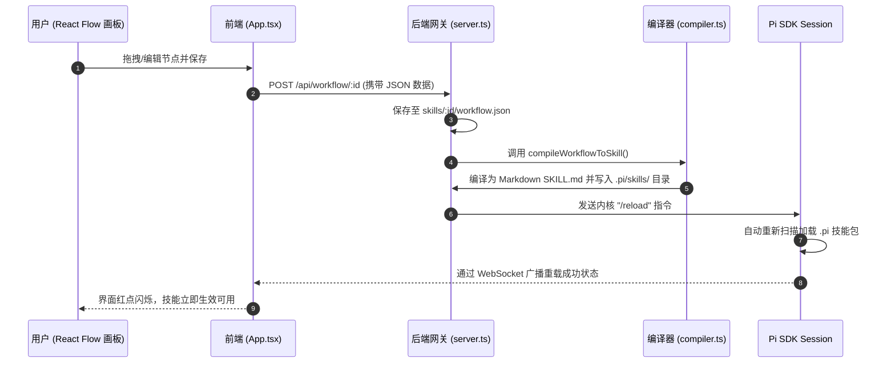
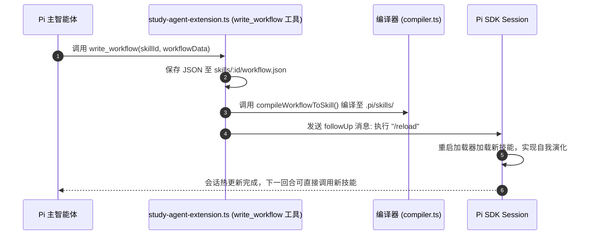
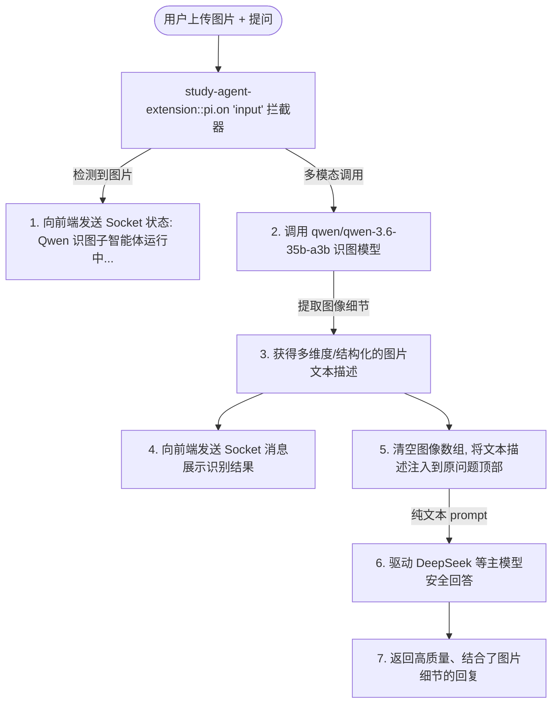

# 🚀 projectEL - 基于 Pi Agent 内核的辅助学习智能体系统

[](https://opensource.org/licenses/MIT)
[](https://nodejs.org/)
[](https://reactjs.org/)

`projectEL` 是一款专为**开发者与终身学习者**打造的智能辅助学习系统。它基于 **Pi Agent** 开发套件，深度融合了“苏格拉底教学智能体”、可视化低代码工作流画板（Dify-style Canvas），并规划了创新的“双轨遗忘曲线”常青记忆图谱体系。

---

## 🗺️ 架构设计与编译热更新双闭环

项目采用 **Monorepo** 单体多包架构管理，其中包含前端卡片式 Web 界面、Node.js 统一后端网关，以及本地打包的 `pi-sdk` 内核组件。

### 1. 目录结构概览
```text
projectEL/
├── backend/                       # Node.js Express 后端网关服务
│   ├── src/
│   │   ├── server.ts              # WebSocket/HTTP 网关，负责 Pi Session 驱动与生命周期
│   │   ├── compiler.ts            # 可视化工作流 JSON 编译为 SKILL.md 编译器
│   │   └── study-agent-extension.ts # Pi Agent 自定义工具扩展与输入拦截器
│   └── package.json
├── frontend/                      # Vite + React + TypeScript + React Flow 前端 UI
│   ├── src/
│   │   ├── components/            # 卡片式多窗口布局组件 (Chat, Canvas 等)
│   │   ├── App.tsx                # 前端主入口与 Socket.io 状态同步
│   │   └── index.css              # 主题与玻璃拟物化设计系统
│   └── package.json
├── pi-sdk/                        # 本地 Pi Agent 内核开发套件 (Packages)
├── skills/                        # 用户/Agent 创建的低代码工作流 (.json)
├── start.bat                      # Windows 环境一键依赖扫描与双端启动脚本
└── package.json                   # 根目录配置与并发启动脚本 (workspaces)
```

---

### 2. 双环编译与运行时动态热重载 (Hot-Reload Loop)

`projectEL` 支持**用户端（画板可视化配置）**与**智能体端（Agent 自我演化）**的双向技能重塑机制，核心编译逻辑位于 [backend/src/compiler.ts](file:///c:/Users/lisky/Desktop/projectEL/backend/src/compiler.ts)。这两个通道编译生成的 `SKILL.md` 会被热加载到运行时中，使系统能够动态生长新能力。

#### 🔄 A环：用户低代码画板编译流
用户在前端 React Flow 拖拽节点，保存后触发编译并实时重载技能。



#### 🔄 B环：智能体自我修饰与演化流
Agent 在会话中发现自己缺乏或需要改善某些功能时，可以通过内置的 `write_workflow` 工具自行编写/更新工作流 JSON。



---

### 3. Qwen 识图子智能体协作流 (Prompt Augmentation)

由于目前推理能力最强的主模型（例如 DeepSeek-R1 / Claude 3.5 Sonnet）部分可能受限于纯文本接口或在直接读取复杂大图时不稳定，系统在 [backend/src/study-agent-extension.ts](file:///c:/Users/lisky/Desktop/projectEL/backend/src/study-agent-extension.ts) 中实现了一个多模态拦截器。



---

## 📋 功能特性矩阵 (Features Matrix)

| 模块分类 | 功能子项 | 当前状态 | 对应代码位置 |
| :--- | :--- | :---: | :--- |
| **基础框架** | Monorepo 依赖及 workspaces 管理 | **已完成** | [package.json](file:///c:/Users/lisky/Desktop/projectEL/package.json) |
| | start.bat 一键环境检测、密钥绑定与双端启动 | **已完成** | [start.bat](file:///c:/Users/lisky/Desktop/projectEL/start.bat) |
| **前端 WebUI** | 卡片式多窗口拖拽与收纳布局 (Workspace) | **已完成** | [frontend/src/App.tsx](file:///c:/Users/lisky/Desktop/projectEL/frontend/src/App.tsx) |
| | 苏格拉底流式交互聊天面板 | **已完成** | [ChatCard.tsx](file:///c:/Users/lisky/Desktop/projectEL/frontend/src/components/ChatCard.tsx) |
| | 模型选择与 API 密钥快捷配置齿轮面板 | **已完成** | [SettingsPanel.tsx](file:///c:/Users/lisky/Desktop/projectEL/frontend/src/components/SettingsPanel.tsx) |
| **Pi 工作流** | Dify-style 可视化 React Flow 工作流画板 | **已完成** | [CanvasCard.tsx](file:///c:/Users/lisky/Desktop/projectEL/frontend/src/components/CanvasCard.tsx) |
| | `workflow.json` ➔ `SKILL.md` Markdown 编译器 | **已完成** | [compiler.ts](file:///c:/Users/lisky/Desktop/projectEL/backend/src/compiler.ts) |
| | `write_workflow` 智能体自我技能修改与热重载工具 | **已完成** | [study-agent-extension.ts](file:///c:/Users/lisky/Desktop/projectEL/backend/src/study-agent-extension.ts) |
| **多模态代理** | Qwen-35B-Vision 子智能体识图拦截与提示词增强 | **已完成** | [study-agent-extension.ts](file:///c:/Users/lisky/Desktop/projectEL/backend/src/study-agent-extension.ts) |
| **双轨知识库** | Obsidian 知识图谱与 YAML 间隔重复 (SM-2/FSRS) 存储 | *设计中* | [知识库白皮书V2](file:///c:/Users/lisky/Desktop/projectEL/knowledge_base_architecture_v2.md) |
| | LLM 动态编译网卡片的指数衰减 ($C(t)$ 指数衰减模型) | *设计中* | [知识库白皮书V2](file:///c:/Users/lisky/Desktop/projectEL/knowledge_base_architecture_v2.md) |
| | 每周 `inbox/archive_review.md` 归档预告与大扫除机制 | *设计中* | [知识库白皮书V2](file:///c:/Users/lisky/Desktop/projectEL/knowledge_base_architecture_v2.md) |
| **QQ Bot 兼容** | **对接入 NapCat QQ 框架 (OneBot v11 协议)** | **未完成 (待开发)** | 后端 OneBot 连接适配器与前端 QQ Bot 绑定/设置面板 (排除画板工作流编辑，仅支持通知与 Quiz 答题交互) |

---

## 🛠️ 快速开始

### 1. 环境依赖
确保您的系统安装了以下环境：
- **Node.js**: `v18.0.0` 或更高版本
- **npm**: `v9.0.0` 或更高版本
- **操作系统**: Windows (若在 macOS/Linux 运行需手动提取 `start.bat` 内的服务启动命令)

### 2. 安装项目依赖
在项目根目录下执行以下命令，由于配置了 workspace，它将自动安装前端、后端以及 SDK 所需的全部依赖：
```bash
npm install
```

### 3. 配置 API 密钥 (两种方式)
在启动智能体前，系统需要至少配置一个 LLM Provider 凭证。
- **方式 A (推荐)**：直接运行项目后，在 Web 界面左下角点击 **设置齿轮按钮 ⚙️**，在弹出的面板中填入 API Key、Base URL 以及激活模型，系统会自动将其持久化到项目根目录下的 `.pi/auth.json` 和 `.pi/models.json` 中。
- **方式 B (环境变量)**：在系统中或控制台中配置环境变量：
  - `DEEPSEEK_API_KEY`: 您的 DeepSeek API Key (注: 勿设置代理 Key 导致解析失败)
  - `DASHSCOPE_API_KEY`: 您的 阿里 DashScope (通义千问/Qwen) API 凭证
  - `ANTHROPIC_API_KEY`: 您的 Anthropic Claude API Key
  - `OPENAI_API_KEY`: 您的 OpenAI API Key
  - `OPENROUTER_API_KEY`: 您的 OpenRouter 凭证

### 4. 一键启动
在 Windows 环境下，直接双击项目根目录下的 [start.bat](file:///c:/Users/lisky/Desktop/projectEL/start.bat)。该脚本会自动：
1. 扫描当前系统环境和本地 `.pi/auth.json`，在控制台打印检测到的 API Key 状态。
2. 启动位于 [端口 3000](http://localhost:3000) 的 Express 后端网关，用于驱动 Pi Agent 引擎。
3. 启动位于 [端口 5173](http://localhost:5173) 的 Vite 前端 Dev Server。
4. 自动弹出两个命令提示符窗口，分别输出前端与后端的实时运行日志。

---

## 📅 长期路线图 (Roadmap)

- [ ] **完成双轨记忆知识库编译联动**：
  - 开发 `wiki-lint` 守护脚本，读取 Obsidian Markdown 顶部的 YAML Frontmatter，支持 SM-2/FSRS 间隔计算更新。
  - 实现 Layer 3 (`wiki_core/`) 指数衰减和阈值归档，智能重构 Obsidian 内部的关联链路。
- [ ] **NapCat QQ Bot 客户端适配**：
  - 在 `backend/src` 中增加 `qq-bot-adapter.ts`，建立与 NapCat.QQ WebSocket 的心跳机制。
  - 实现系统主动定时发送背诵与测验 Quiz 卡片。
  - 支持在 QQ 私聊或群聊中，通过直接回复数字（如选择 A/B/C/D）完成学习测验反馈并记录答题正确率。