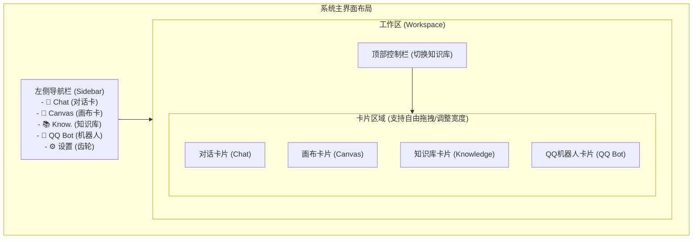
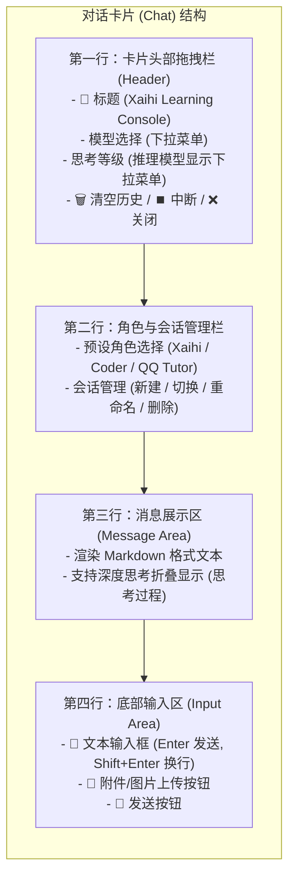
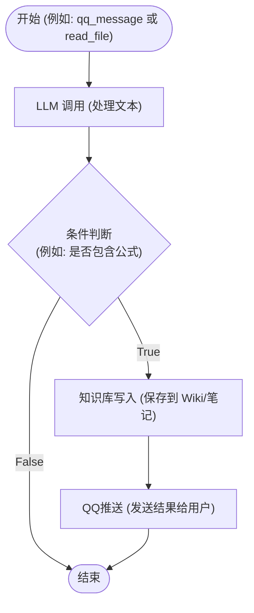
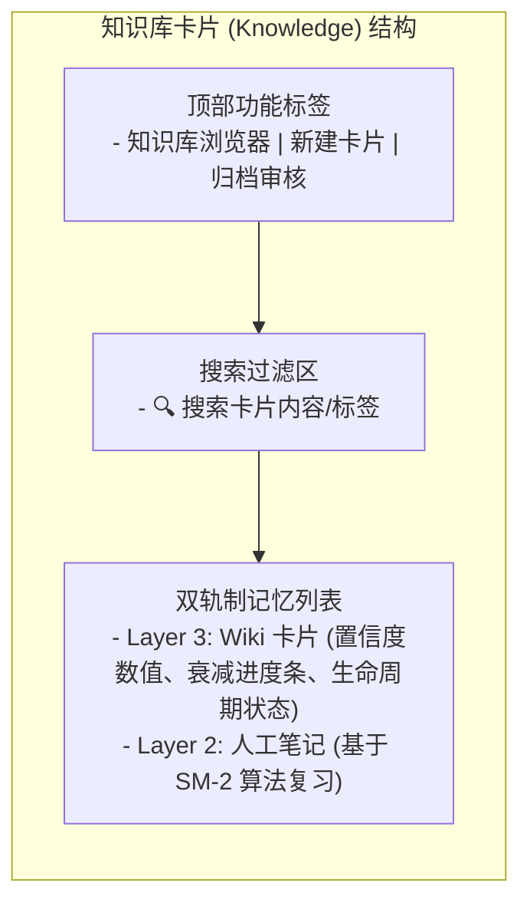

# Snapshot Pi 使用手册

> **Snapshot Pi** — 基于 Pi Agent 内核的 AI 辅助学习智能体系统  
> 版本: 1.0.0 | 更新日期: 2026-06-13

---

## 目录

- [1. 快速开始](#1-快速开始)
- [2. AI 对话（Chat）](#2-ai-对话chat)
- [3. 工作流画布（Canvas）](#3-工作流画布canvas)
- [4. 知识库（Knowledge）](#4-知识库knowledge)
- [5. QQ 机器人（QQ Bot）](#5-qq-机器人qq-bot)
- [6. 系统设置](#6-系统设置)
- [7. 常见问题与排错](#7-常见问题与排错)
- [附录](#附录)

---

## 1. 快速开始

### 1.1 环境要求

| 项目 | 要求 |
|------|------|
| 操作系统 | Windows 10 / 11 |
| Node.js | >= 18.0.0 |
| npm | >= 9.0.0 |
| 磁盘空间 | 约 2GB（含 QQ Bot 依赖） |
| 网络 | 需要能够访问 AI 服务商的 API 端点 |
| Git | 可选（用于更新项目） |

### 1.2 首次部署

首次使用前需要运行一次性初始化脚本，完成环境配置：

```bash
# 克隆项目后，在项目根目录执行：
scripts\setup.bat
```

`setup.bat` 会自动完成以下步骤：

| 步骤 | 内容 | 说明 |
|:---|:---|:---|
| 1 | 环境检查 | 检测 Node.js / npm 版本 |
| 2 | 安装依赖 | 执行 `npm install` 安装所有依赖 |
| 3 | API Key 配置 | 交互式向导，引导你填写 API Key 并保存到 `.pi/auth.json` |
| 4 | NapCat 部署 | 自动下载 NapCat QQ 机器人框架并配置 |
| 5 | 前端构建 | 构建前端资源到 `frontend/dist/` |

> **提示**：首次部署只需执行一次。如需重装，可以加 `--force` 参数强制重新初始化。

### 1.3 日常启动

```bash
# 双击 start.bat，或在命令行执行：
start.bat
```

启动后浏览器会自动打开 `http://localhost:3000`，进入主界面。

`start.bat` 做的事情很简单：
1. 启动后端服务（Express，端口 3000，内置托管前端页面）
2. 自动打开浏览器

### 1.4 首次配置

进入系统后，需要配置 AI 服务商才能开始对话：

1. 在浏览器中打开 `http://localhost:3000`（或 `http://localhost:5173`）
2. 点击左侧边栏底部的 ⚙️ **齿轮图标**，打开设置面板
3. 添加一个 AI 服务商（详见 [6. 系统设置](#6-系统设置)）：
   - 填入 **API 地址**（Base URL）
   - 填入 **API Key**
   - 添加该服务商提供的**模型名称**
4. 启用该服务商，并选择一个模型作为当前使用的 AI
5. 关闭设置面板，即可开始对话

**支持的 AI 服务商：**

| 服务商 | Base URL | 模型示例 |
|:---|:---|:---|
| **DeepSeek** | `https://api.deepseek.com` | DeepSeek V4 Pro / Flash |
| **Qwen（通义千问）** | `https://dashscope.aliyuncs.com/compatible-mode/v1` | Qwen3.6 Plus / Flash |
| **Anthropic（Claude）** | `https://api.anthropic.com` | Claude Opus 4.7 / Sonnet 4.6 |
| **OpenAI（GPT）** | `https://api.openai.com/v1` | GPT-5.4 / GPT-4.1 |
| **Google（Gemini）** | `https://generativelanguage.googleapis.com/v1beta` | Gemini 3.1 Pro / 2.5 Pro |

> **关于 Qwen 的特殊说明**：使用通义千问模型需要到[阿里云百炼平台](https://bailian.console.aliyun.com/)开通 DashScope 服务，并在"模型广场"中手动开启所需模型的授权（新账号默认不开启）。然后在设置面板中选择 Qwen，填入 API Key 并点击"填官方参数"自动填入 Base URL 即可。

### 1.5 端口分配

| 服务 | 端口 |
|:---|:---:|
| 后端 API（Express + Socket.io，托管前端页面） | 3000 |
| QQ Bot WebSocket（NapCat 连接） | 3001 |
| NapCat WebUI 管理面板 | 6099 |

### 1.6 界面总览

主界面由以下部分组成：



- **侧边栏（Sidebar）**：左侧图标栏，用于切换显示/隐藏各功能卡片
- **顶部栏（Header）**：知识库切换下拉菜单
- **工作区（Workspace）**：中央区域，可同时显示多张功能卡，卡片支持拖拽调整位置和宽度

---

## 2. AI 对话（Chat）

### 2.1 功能简介

Chat 卡是 Snapshot Pi 的核心交互界面。你可以在这里与 AI 进行多轮对话，系统支持：

- 多个预设 AI **角色**（Preset），每个角色有不同的性格和回答风格
- 多个**会话**（Session），方便切换不同话题
- 多种**模型**（Model），可在对话中随时切换
- 图片上传与自动识别（即使当前模型不支持视觉也能通过辅助模型处理）
- 流式输出，实时查看 AI 的回答

### 2.2 界面说明

Chat 卡界面：



- **顶部控制栏 (Header)**：包含卡片标题 `💬 Xaihi Learning Console`，当前活跃模型选择下拉菜单，当所选模型支持推理（Reasoning）时展示的“思考”等级下拉菜单，以及清除当前对话历史的“🗑️ 垃圾桶”按钮、中断流式输出的“⏹️ 中断”按钮或隐藏窗口的“❌ 关闭”按钮。
- **角色与会话管理栏**：在头部下方的控制条中，左侧下拉选择预设 AI 角色，右侧下拉选择会话、新建会话、重命名或删除当前会话。
- **消息区**：显示对话历史，支持标准的 Markdown 渲染及深度思考过程的折叠展示。
- **输入区**：底部文本输入框（支持 Enter 发送，Shift+Enter 换行）+ 📎 附件/图片上传按钮 + 🚀 发送按钮。

### 2.3 发送消息

1. 在底部输入框中输入文字
2. 按 **Enter** 发送（或点击 🚀 按钮）
3. AI 会以流式方式逐字生成回答
4. 回答过程中可点击 **停止** 按钮中断生成

> **贴士**：AI 已开启**深度思考**模式时，回答前会先展示思考过程（灰色区域），帮助你理解 AI 的推理逻辑。

### 2.4 切换 AI 角色（预设）

系统内置了三个预设角色：

| 角色 | 名称 | 特点 |
|------|------|------|
| 🎓 **Xaihi** | 苏格拉底式导师 | **从不直接给出答案**，通过提问引导你自己找到答案。适合深度学习 |
| 💻 **Coder** | 软件工程专家 | 精通编程、架构设计、代码审查，会直接给出技术方案和代码 |
| 🤖 **QQ Tutor** | QQ 群助手 | 用于 QQ Bot 场景，回答简洁精炼，适合群聊环境 |

切换方式：点击顶部左下拉菜单，选择想要的预设角色即可。

### 2.5 管理会话

会话（Session）用于保存不同主题的对话历史。

**常用操作：**

| 操作 | 方法 |
|------|------|
| **新建会话** | 点击会话下拉菜单 → 输入新会话名称 → 确认 |
| **切换会话** | 点击会话下拉菜单 → 选择已有会话 |
| **重命名会话** | 在会话下拉菜单中点击对应会话的编辑按钮 |
| **删除会话** | 在会话下拉菜单中点击对应会话的删除按钮（默认会话不可删除） |
| **清空消息** | 点击输入区上方的清空按钮，清除当前会话的所有消息 |

> **贴士**：不同会话的对话历史互不干扰，建议按话题或学习科目建立不同会话。

### 2.6 切换模型与思考模式

在对话过程中，你可以直接在 Chat 窗口顶部的控制栏（Header）中实时切换模型和设置思考深度：

1. **选择模型**：在控制栏第一行的 **“模型:”** 后点击下拉菜单，直接在当前已启用且已配置 API Key 的模型列表中选择一个活跃模型。
2. **设置思考等级**（Reasoning）：
   - 当选中的模型支持深度推理（如 DeepSeek-R1 等 Reasoning 模型）时，控制栏中会自动显示 **“思考:”** 选择器。
   - 点击“思考:”下拉菜单，可选择不同的思考级别：`off`（关闭思考，加快响应）、`minimal`、`low`、`medium`（中等）、`high`（高）、`xhigh`。
   - 如果选择的模型不支持推理，则“思考:”选项框会自动隐藏。

> **贴士**：切换模型或思考等级时，当前会话的上下文及对话历史将完整保留，方便随时使用不同的 AI 算力继续探讨。

### 2.7 上传图片

Chat 卡支持上传图片，让 AI 分析和描述图片内容：

1. 点击输入区右侧的 📎（附件）按钮或 🖼️（图片）按钮
2. 选择一张图片文件
3. 输入想询问的问题（如"这张图里有什么？"）
4. 发送消息

**工作原理**：如果当前模型本身支持视觉识别，图片会直接发送给它。如果不支持，系统会自动调用一个支持视觉的模型（如 Qwen-VL）提取图片的文字描述，然后将描述注入给当前模型——你无需关心背后的切换过程。

---

## 3. 工作流画布（Canvas）

### 3.1 功能简介

Canvas 卡是一个**可视化工作流编辑器**，让你通过拖拽节点的方式构建 AI 自动化流程，无需编写代码。

每次保存画布后，系统会自动将工作流编译成一个可执行的技能（Skill），AI 助手就能调用这个工作流来执行复杂任务。

### 3.2 界面说明



- **顶部工具栏**：保存按钮、模板选择、验证状态指示
- **画布区**：拖拽编辑工作流的区域
- **节点面板**：底部的可拖拽节点列表，分门别类

### 3.3 使用模板创建工作流

新手推荐从模板开始：

1. 点击顶部的 **选择模板** 下拉菜单
2. 选择一个预置模板：
   - **课程分组待办** — 课程任务分组工作流
   - **课件卡片** — 自动生成知识卡片的工作流
   - **苏格拉底测验** — 自动出题测试工作流
   - **每日简报** — 每日信息汇总工作流
   - **空白模板** — 完全从零开始
3. 模板加载后，可在画布上自由编辑调整
4. 点击 **💾 保存** 按钮编译生效

### 3.4 从空白开始编辑

1. 在模板中选择**空白模板**，或直接清空画布
2. 从底部**节点面板**拖拽节点到画布
3. 将鼠标悬停在节点边缘，出现连接点后拖拽连线到另一个节点
4. 点击节点可在右侧编辑其参数
5. 点击 **💾 保存** 编译生效

**编辑操作：**

| 操作 | 方法 |
|------|------|
| **移动节点** | 拖拽节点标题区域 |
| **连接节点** | 从节点边缘的连接点拖到另一个节点 |
| **删除连接** | 点击连线（变红激活）后再按 **Delete** 键 |
| **删除节点** | 选中节点后按 **Delete** 键，或将鼠标悬停在节点上点击右上角出现的 **小“X”按钮** |
| **复制节点** | 选中节点后按 **Ctrl + D** 快捷键 |
| **编辑参数** | 点击节点，在弹出面板中修改参数 |

### 3.5 节点类型说明

| 分组 | 节点 | 功能 |
|------|------|------|
| **输入** | `qq_message` | 接收 QQ 消息作为触发 |
| **AI 处理** | `llm` | 调用大模型进行处理 |
| | `socratic` | 苏格拉底式问答节点 |
| **输出** | `qq_push` | 向 QQ 推送消息 |
| | `knowledge_write` | 写入知识库 |
| **工具** | `bash` | 执行 shell 命令 |
| | `read_file` | 读取文件内容 |
| | `write_file` | 写入文件 |
| | `api_request` | 发送 HTTP 请求 |
| | `mcp_tool` | 调用 MCP 工具 |
| **控制** | `condition` | 条件判断分支 |
| | `loop` | 循环执行 |
| | `subagent` | 调用子智能体 |

### 3.6 验证与排错

保存时系统会自动验证工作流的正确性：

- **✅ 验证通过** — 工作流有效，已编译为技能
- **❌ 验证失败** — 会提示具体问题：
  - **类型不兼容**：节点的输入输出类型不匹配
  - **不可达节点**：存在不被执行的孤立节点
  - **缺少必要字段**：某些节点未填必填参数
  - **循环检测**：存在无限循环风险

> **贴士**：验证失败时，画布上会用红色标记问题节点，方便定位修复。

---

## 4. 知识库（Knowledge）

### 4.1 功能简介

Knowledge 卡是一个**双轨制记忆知识库**，模拟人脑的记忆机制：

- **Layer 3 — Wiki 卡片**：AI 动态知识网络，卡片具有置信度（Confidence），会随时间衰减，需要定期复习巩固
- **Layer 2 — 人工笔记**：使用 SM-2 间隔重复算法（类似 Anki）管理复习计划

系统在对话时会自动检索相关的知识卡片，注入到 AI 的上下文提示中，让 AI 的回答基于你积累的知识。

### 4.2 界面说明



### 4.3 Wiki 卡片管理

**创建卡片：**

1. 点击 **新建卡片** 按钮
2. 填写以下信息：
   - **标题**：知识点的名称
   - **正文**：知识点的详细内容。Wiki 卡片正文支持**紧凑 Markdown 格式渲染**，你可以使用：
     - **层级标题**（`#` 至 `####`）
     - **粗体强调**（`**文本**`，将以系统主题色加粗显示）
     - **列表**（无序 `*` / 有序 `1.`）
     - **代码块**（支持行内 `` `code` `` 和独立代码块，系统会自动优化其在卡片内的展示比例）
     - **引用块**（`>`）
     - **数据表格**（支持标准 GFM 格式表格）
     - **双链关联**（使用 `[[关联卡片名称]]` 语法可在不同卡片之间建立链接）
   - **标签**：用逗号分隔的关键词标签
   - **生命周期**：选择衰减速度（见下文）
3. 点击保存

**查看与编辑：**

| 操作 | 方法 |
|------|------|
| **查看详情** | 点击卡片列表中的任意卡片 |
| **编辑卡片** | 在详情页点击编辑按钮 |
| **搜索卡片** | 在搜索框中输入关键词 |
| **提升置信度** | 在详情页点击"提升"按钮，手动增加卡片置信度 |
| **删除卡片** | 在详情页点击删除按钮 |

### 4.4 遗忘曲线与置信度

每张 Wiki 卡片都有一个 **置信度分数**（0%–100%），会随时间按照遗忘曲线衰减。

**三种生命周期：**

| 生命周期 | 半衰期 | 图标 | 说明 |
|----------|--------|------|------|
| **不朽（Immortal）** | 永不衰减 | 🟢 | 核心知识点，永久保留 |
| **标准（Standard）** | ~180 天 | 🟡 | 常规知识点，半年衰减一半 |
| **快速衰减（Fast Decay）** | ~14 天 | 🔴 | 临时性知识，两周衰减一半 |

**置信度颜色指示：**

| 颜色 | 范围 | 含义 |
|------|------|------|
| 🟢 绿色 | ≥ 60% | 掌握良好 |
| 🟡 黄色 | 15%–59% | 需要复习 |
| 🔴 红色 | < 15% | 即将归档 |
| ⚫ 灰色 | 已归档 | 不再在主列表显示 |

> **贴士**：定期查看置信度低的卡片并点击"提升"按钮，可以对抗遗忘曲线，巩固知识。

### 4.5 笔记复习（SM-2）

笔记是人工编写的复习内容，使用 SM-2 间隔重复算法（与 Anki 相同）安排复习计划：

1. 在知识库中切换到**笔记**选项卡
2. 查看待复习的笔记列表
3. 点击一条笔记，回忆其内容
4. 给自己的回忆质量打分（0–4 分）：
   - **0 分**：完全忘记
   - **1 分**：看到答案后想起来
   - **2 分**：有些困难但答对了
   - **3 分**：顺利答对
   - **4 分**：完美回忆
5. 系统会根据评分自动计算下一次复习时间

### 4.6 知识库归档

置信度低于 15% 的卡片会成为**归档候选**。系统提供了归档审核流程：

1. 点击 **归档审核** 按钮
2. 点击 **扫描归档候选**，系统会列出所有低置信度卡片
3. 逐张审核候选卡片：
   - **设为不朽**：如果知识点仍然重要，可将其生命周期改为"不朽"以永久保留
   - **确认归档**：如果知识已过时，确认归档
4. 点击 **执行归档**，系统会将归档卡片移动到特殊区域（对检索不可见）

> **贴士**：归档不是删除。卡片仍然保存，可以随时恢复或查看。

### 4.7 多知识库切换

系统支持创建多个独立的知识库，适合按学科或项目分类：

1. 点击顶部栏的知识库下拉菜单
2. 选择已有的知识库
3. 创建新知识库：在菜单中输入名称并确认
4. 删除知识库：在菜单中选择删除（默认知识库不可删除）

AI 对话时只会检索**当前选中知识库**中的卡片。

---

## 5. QQ 机器人（QQ Bot）

### 5.1 功能简介

QQ Bot 功能让你的 Snapshot Pi 连接到 QQ，成为一个 AI 学习助手。它基于 **NapCatQQ** 框架（独立模式，无需安装 QQ 客户端），支持：

- **AI 私聊**：与 AI 一对一对话
- **群聊触发**：在群中使用 `/ai` 命令召唤 AI
- **智能测验**：AI 自动出题，评估知识掌握程度
- **知识提取**：自动从聊天中提取有价值的知识点并存入知识库
- **周报生成**：每周学习报告

### 5.2 启动与停止

在 QQ Bot 卡中操作：

1. **启动**：点击 **启动** 按钮
   - 系统会自动检查 NapCat 环境，如缺失则自动部署
   - 等待状态变为"已连接"表示启动成功
2. **停止**：点击 **停止** 按钮

**状态指示：**

| 状态 | 含义 |
|------|------|
| 🟢 已连接 | QQ Bot 正常运行 |
| 🟡 启动中 | NapCat 正在启动 |
| 🔴 未连接 | QQ Bot 未运行 |
| ⚪ 离线 | NapCat 运行但 QQ 未登录 |

> **贴士**：首次启动 NapCat 时会自动打开一个二维码窗口，需要用 QQ 手机端扫码登录。

### 5.3 聊天命令

| 命令 | 适用 | 功能 |
|------|------|------|
| 直接发消息 | 私聊 | 与 AI 自由对话 |
| `/ai <消息>` | 群聊 | 召唤 AI 回答 |
| `/ask <问题>` | 群聊 | 向 AI 提问（同上） |
| `/help` | 私聊/群聊 | 查看帮助信息 |
| `/stats` | 私聊/群聊 | 查看自己的学习统计数据 |

> **贴士**：私聊中不需要使用 `/ai` 前缀，直接说话即可。

### 5.4 测验系统

AI 可以针对你的知识薄弱点自动生成测验题：

| 命令 | 功能 |
|------|------|
| `/quiz start` | 开始一轮测验 |
| `/quiz stop` | 结束当前测验 |

**测验流程：**

1. 发送 `/quiz start`
2. AI 会根据知识库中置信度较低的卡片生成题目
3. 回答题目后，AI 会给出反馈和正确答案
4. 每答对一题获得 **XP 经验值**（0–10 XP），取决于题目难度
5. 发送 `/quiz stop` 结束本轮测验

### 5.5 周报功能

系统每周自动生成学习分析报告，也可手动查看：

| 命令 | 功能 |
|------|------|
| `/report` | 查看本周学习报告 |

报告内容包括：
- 高频学习话题
- 最薄弱的知识点（置信度最低的卡片）
- 测验得分趋势
- XP 总经验值

### 5.6 状态监控

在 QQ Bot 卡中可以实时查看：

- **连接状态**：当前 QQ 账号在线状态
- **消息统计**：今日处理的消息数量
- **测验数据**：累计测验次数、平均得分、总 XP
- **薄弱知识点**：需要重点复习的知识点列表

---

## 6. 系统设置

### 6.1 打开设置

点击侧边栏底部的 ⚙️ **齿轮图标**，右侧会滑出设置面板。

### 6.2 管理 AI 服务商

**添加新服务商：**

1. 在设置面板中点击 **添加服务商**
2. 在弹出的对话框中填写：
   - **服务商名称**：自定义名称（如"我的 DeepSeek"）
   - **API 地址**：服务商的 API 端点 URL
   - **API Key**：你的 API 密钥
   - **模型列表**：该服务商提供的模型名称（每行一个）
3. 点击确认添加

**删除服务商：**

在服务商列表中点击对应项的删除按钮即可。

> **贴士**：系统预设了几个常见服务商（DeepSeek、Qwen、Anthropic、OpenAI），但你也可以添加任何兼容 OpenAI API 格式的第三方服务商。

### 6.3 管理 API Key

- **添加/修改**：在服务商配置中填入新的 API Key
- **隐藏/显示**：点击密码图标切换可见性
- **删除**：清空 API Key 字段

> ⚠️ **注意**：API Key 仅存储在本地文件（`.pi/auth.json`）中，不会上传到任何第三方服务。

### 6.4 选择模型

1. 在可用模型列表中选择一个模型作为当前活跃模型
2. 可选的**思考等级**控制 AI 推理深度：
   - 较低等级：响应更快，适合简单问答
   - 较高等级：推理更深入，适合复杂分析
3. 点击确认后设置生效

---

## 7. 常见问题与排错

### 7.1 启动问题

**Q: 启动时提示"端口被占用"**

确保 3000（后端）和 5173（前端）端口没有被其他程序占用，或修改 `backend/src/server.ts` 和 `frontend/vite.config.ts` 中的端口配置。

**Q: `start.bat` 闪退**

打开终端命令行手动执行 `start.bat` 查看错误信息。常见原因：Node.js 版本过低或未安装依赖。

### 7.2 连接问题

**Q: 浏览器打开后一片空白或无法连接**

1. 检查后端终端是否正常运行（应能看到"Server running on port 3000"）
2. 检查前端终端是否正常运行（应能看到"Vite server running on port 5173"）
3. 尝试刷新浏览器页面

**Q: AI 不回复或回复后卡住**

1. 检查 API Key 是否正确配置
2. 检查网络是否能正常访问 AI 服务商的 API
3. 尝试在设置中切换到其他模型
4. 点击**停止**按钮后重新发送消息

### 7.3 QQ Bot 问题

**Q: QQ Bot 启动失败**

1. 检查 NapCat 是否正常部署（首次启动会自动部署）
2. 检查 QQ 账号是否正常登录（NapCat 会弹出二维码窗口）
3. 查看后端终端的错误日志

**Q: QQ Bot 不响应群聊消息**

1. 确认在群中使用了正确的命令前缀（`/ai` 或 `/ask`）
2. 检查 QQ Bot 是否处于"已连接"状态
3. 检查群聊消息是否触发了频率限制

### 7.4 知识库问题

**Q: 创建的知识卡片在对话中未被使用**

1. 确认当前知识库是否正确（顶部下拉菜单）
2. 确认卡片置信度不是过低（低于 15% 的卡片可能已归档）
3. 尝试点击"提升"增加卡片置信度

**Q: 卡片意外消失了**

检查是否被自动归档了。进入"归档审核"功能查看归档候选列表。

---

## 附录

### A. 快捷键参考

| 快捷键 | 功能 |
|--------|------|
| **Enter** | 发送消息 |
| **Shift + Enter** | 输入换行 |
| **Ctrl + D** | （画布中）复制选中节点 |
| **Delete** | （画布中）删除选中节点/连线 |

### B. 术语表

| 术语 | 说明 |
|------|------|
| **Pi Agent** | 系统的 AI 智能体内核，负责管理 AI 会话、工具调用和工作流执行 |
| **Preset / 预设** | AI 角色的行为配置文件，定义了回答风格和知识领域 |
| **Session / 会话** | 一组连续的对话历史记录 |
| **Wiki 卡片** | 知识库中的基本知识单位，包含标题、正文、标签和置信度 |
| **置信度** | 衡量知识掌握程度的分数（0%–100%），会随时间衰减 |
| **SM-2** | 间隔重复算法，用于安排笔记的最优复习时间点 |
| **半衰期** | 置信度衰减到一半所需的天数 |
| **NapCat** | QQ 机器人框架，以独立模式运行，无需 QQ 桌面客户端 |
| **OneBot v11** | QQ 机器人的标准通信协议 |
| **工作流** | 由多个节点组成的有向流程图，定义了 AI 的自动化处理逻辑 |
| **Skill** | 工作流编译后的产物，AI 可以理解和执行的技能描述 |
| **双链（Wikilink）** | `[[卡片名称]]` 语法，用于在知识卡片之间建立关联 |
| **XP** | 经验值，通过回答测验题目获得 |

---

> **Snapshot Pi** — 让 AI 辅助你的每一次学习  
> 项目地址：[GitHub](https://github.com/liskydrift/projectEL)  
> 如有问题或建议，欢迎提交 Issue
