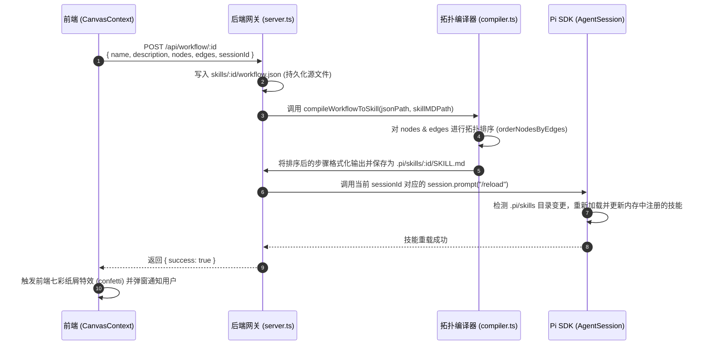
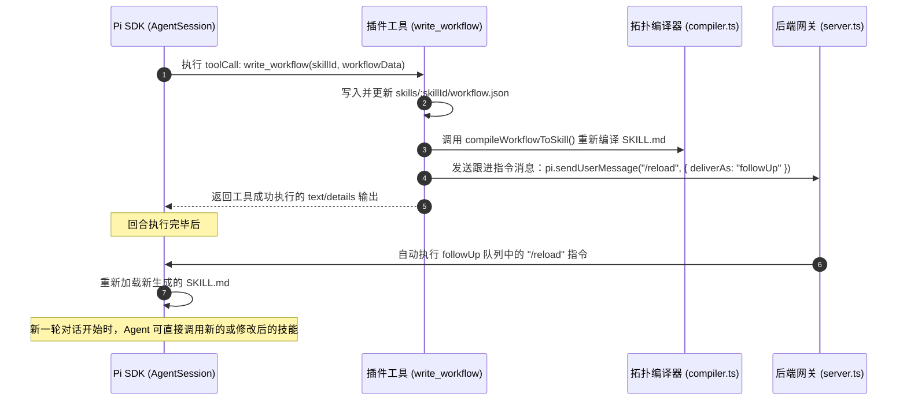
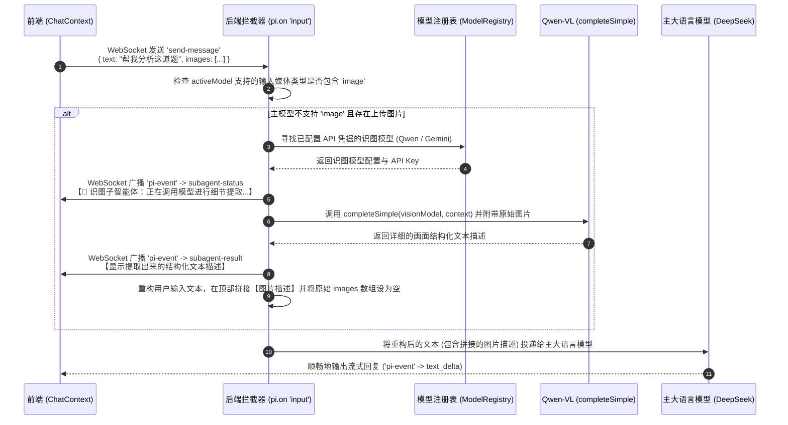

# Snapshot Pi 开发者与架构技术手册

本手册为 `Snapshot Pi` 系统的核心架构参考与日常维护指南，阐述了系统的技术栈、物理目录、微架构时序、数据接口协议、核心算法模型以及针对硬编码组件的未来重构方向。

---

## 1. 项目定位与核心目标

`Snapshot Pi` 是一款专为**开发者与终身学习者**打造的智能辅助学习系统。它基于 **Pi Agent** 智能体开发内核，融合了“启发式学习智能体”、可视化低代码工作流画布，并实现了“双轨遗忘曲线”常青记忆知识库体系与 QQ 移动端个人助理。

### 1.1 系统架构层级
项目采用一体化的多包管理模式，包含以下四个核心功能层：
* **前端交互层 (Frontend)**：基于毛玻璃（Glassmorphism）镜面流光视觉风格，提供多窗口拖拽分栏的卡片式工作区，以及低代码工作流画布。
* **后端网关层 (Backend)**：提供统一的数据服务和多会话管理，并利用 Socket.io 实现高实时性的双向消息流。
* **智能体内核 (Pi SDK)**：驱动智能体的逻辑编排、工作流技能动态编译与热重载。
* **移动辅助端 (QQ Bot)**：通过嵌入式协议适配器实现与个人 QQ 账号的绑定，提供随时随地的移动端对话、自测与学习监控。

---

## 2. 团队分工与职责规划

为保障项目在前端视觉、AI 内核、学习闭环三个维度上全面推进，4 名团队成员的分工划分如下（均承担具体代码编写工作）：

*   **开发者 A —— AI 交互与核心算法 (AI & Core Algorithm)**
    1.  **多智能体编排**：设计串行、并行、监督及路由等多种多代理协作模式。
    2.  **启发式交互逻辑**：设计系统提示词拦截注入机制，优化启发式对话。
    3.  **指数衰减与复习算法**：演进并调优双轨知识库的掌握度评估数学模型。
*   **开发者 B —— 后端业务与消息网关 (Backend & Messaging Gateway)**
    1.  **QQ Bot 移动适配**：负责限流控制、心跳保活及公式服务端截图渲染。
    2.  **会话与预设管理**：开发会话创建、删除及历史会话多端同步的后端逻辑。
    3.  **数据统计与自测报告**：设计自测题库生成接口以及学习经验值 (XP) 统计和周报导出接口。
*   **开发者 C —— 前端界面与可视化交互 (Frontend & Visualization)**
    1.  **毛玻璃主题重构**：实现双主题、弥散流光动态背景及卡片磨砂质感。
    2.  **2D 知识图谱**：开发基于双链拓扑关系的交互式力导向粒子网络。
    3.  **画布节点与 AI 协写**：在 React Flow 中扩充控制节点，并在配置抽屉内集成 AI 协写气泡。
*   **开发者 D —— 系统集成与质量保障 (Integration & Quality Assurance)**
    1.  **低代码拓扑编译器**：开发并维护工作流到技能文件的拓扑排序编译与热加载重载闭环。
    2.  **自动化测试套件**：编写核心算法（SM-2、置信度）的单元测试，以及主业务流的端到端（E2E）功能测试。

---

## 3. 技术栈配置详解

项目采用 **Monorepo** 架构，利用 `npm workspaces` 统一进行前端、后端及 `pi-sdk` 本地开发包的多包依赖与编译管理。

| 模块 | 技术 / 依赖库 | 核心作用与版本 | 配置文件 |
| :--- | :--- | :--- | :--- |
| **Monorepo 容器** | Node.js (>=18.0.0)<br>npm workspaces | 统一管理子包，免去本地多包发布，建立包内本地软链接 | [package.json (Root)](file:///c:/Users/lisky/Desktop/projectEL/package.json) |
| **前端服务 (frontend)** | React (v18)<br>Vite<br>TypeScript<br>@xyflow/react (v12)<br>Socket.io Client (v4)<br>Lucide React | 前端视图层，高响应的画布及聊天交互；采用 Vite 作为极速构建工具；利用 React Flow 绘制拓扑节点图谱；Socket.io 进行实时双向长连接通信。 | [package.json (Frontend)](file:///c:/Users/lisky/Desktop/projectEL/frontend/package.json) |
| **后端网关 (backend)** | Node.js Express<br>Socket.io Server (v4)<br>fs-extra<br>tsx watch<br>Typebox | 提供 16 个 REST API 端点；通过 WebSocket 管理流式消息广播；使用 `tsx watch` 在开发阶段自动热重启服务；使用 Typebox 对输入参数执行强类型约束。 | [package.json (Backend)](file:///c:/Users/lisky/Desktop/projectEL/backend/package.json) |
| **内核 SDK (pi-sdk)** | `@earendil-works/` 包 | `@earendil-works/pi-agent`：Pi Agent 主生命周期与运行时管理器。<br>`@earendil-works/pi-ai`：统一的多供应商大模型适配器。<br>`@earendil-works/pi-coding-agent`：提供本地文件、命令行工具链与系统扩展 API。 | [pi-sdk](file:///c:/Users/lisky/Desktop/projectEL/pi-sdk) |

---

## 4. 物理与运行目录结构

### 4.1 Monorepo 物理结构
```text
snapshot-pi/
├── package.json                          # Monorepo 根配置与 npm workspaces 定义
├── tsconfig.base.json                    # 共享的 TypeScript 基础配置
├── start.bat                             # Windows 一键自诊断与双端启动脚本
├── backend/                              # Express 后端服务子工程
│   ├── package.json
│   └── src/
│       ├── server.ts                     # WebSocket/HTTP 网关、Pi Session 管理
│       ├── compiler.ts                   # 拓扑排序：JSON 工作流 -> SKILL.md 编译器
│       ├── study-agent-extension.ts      # Pi 扩展（指令注入、Qwen 拦截器、write_workflow）
│       └── knowledge-base/               # 遗忘曲线知识库引擎与 REST 路由
├── frontend/                             # Vite + React 前端子工程
│   ├── package.json
│   └── src/
│       ├── App.tsx                       # 全局 Context 挂载与卡片总视图
│       ├── contexts/                     # 状态解耦层（Chat, Workspace, Canvas Context）
│       └── components/                   # 各卡片 UI 呈现（ChatCard, CanvasCard, KnowledgeCard）
├── wiki_core/                            # L3 知识库数据存储目录（按 Markdown 格式分类）
│   ├── concepts/                         # immortal 与 standard 状态的概念卡片
│   ├── temporary/                        # decay_fast 状态的临时速记卡片
│   └── archive/                          # 置信度过低归档后的冷数据归档区
├── curated_notes/                        # L2 知识库：供 SM-2 复习的笔记目录
├── sources/                              # L1 知识库：只读的外部源材料
├── inbox/                                # 暂存区目录，存放生成的 archive_review.md
├── skills/                               # 前后端共享的工作流源配置文件与智能体预设
│   └── agent-presets.json                # 预设配置文件（Xaihi 导师、代码专家等）
└── .pi/                                  # Pi Agent SDK 运行时目录（自动生成）
```

### 4.2 `.pi/` 运行时目录
`.pi/` 目录是 Pi SDK 在运行时存放配置、状态、动态热加载扩展和技能的隔离空间，由后端 `server.ts` 自动维护。
*   `auth.json`：供应商 API 凭证。
*   `models.json`：启用的模型列表及 Provider Base URL。
*   `skills/[skillId]/SKILL.md`：由 `compiler.ts` 编译生成的技能定义。
*   `extensions/study-agent-extension.ts`：运行时加载的扩展脚本。
*   `agent/sessions/`：存放聊天会话本地 JSONL 行格式审计日志。

> [!IMPORTANT]
> **运行时同步机制**：为了能够使 Pi 内核加载本地开发的扩展，[server.ts](file:///c:/Users/lisky/Desktop/projectEL/backend/src/server.ts) 在启动时会自动使用 `fs.copy` 将最新的 `study-agent-extension.ts` 强制覆盖拷贝到 `.pi/extensions/` 中。**开发更改应当在 `backend/src/` 中完成，切勿直接修改 `.pi/extensions/` 下的副本**。

---

## 5. 微架构交互与数据流

### 5.1 A环：工作流可视化保存与内核热重载
当用户在前端 Canvas 可视化界面修改并点击“保存并编译工作流”时：


### 5.2 B环：智能体自我修饰与反向技能演化
当主智能体决定在执行任务期间修改或创建可视化技能时：


### 5.3 多模态识图与 Qwen-VL 子智能体拦截机制
当用户上传图片但当前主模型不支持多模态视觉输入时：


---

## 6. 双轨记忆知识库算法与模型

### 6.1 Layer 3: LLM 动态编译知识网 (指数衰减遗忘模型)
系统通过数学公式动态计算每一个 Wiki 卡片的有效置信度，以判断其掌握深度。
*   **计算公式**：
    $$C(t) = C_0 \cdot e^{-\lambda \cdot t}$$
    其中，
    *   $C(t)$ 为当前时间的有效置信度（值域 $[0, 1.0]$）。
    *   $C_0$ 为上次交互后的初始置信度。
    *   $\lambda$ 为该卡片掌握级别的衰减系数（标准级别为 $0.05$，低掌握度极速衰减级别为 $0.15$）。
    *   $t$ 为距离上次交互的流逝天数（浮点数）。
*   **动作响应**：
    *   **Boost（增强）**：每次提问或交互命中卡片，置信度提升 $+0.2$（上限 $1.0$），重置 $t = 0$。
    *   **归档（Archive）**：若有效置信度 $C(t) < 0.15$，系统进行安全审计归档，移动卡片至 `wiki_core/archive/`，并通过正则表达式重写所有关联文件的 `[[双链]]` 为置信度过低归档标志 `**概念名[已归档]**`。

### 6.2 Layer 2: 人类整理笔记 (SM-2 间隔重复算法)
利用标准的 SuperMemo-2 算法规划人类整理笔记的复习间隔。
*   **因子更新**：
    对于每次复习，用户输入评分 $q$（值域 $[0, 4]$）：
    *   新难度因子（Ease Factor）：
        $$EF' = EF + (0.1 - (5 - q) \cdot (0.08 + (5 - q) \cdot 0.02))$$
        *(若 $EF' < 1.3$，强制截断设为 $1.3$)*
    *   复习间隔天数（Interval）：
        *   若 $q < 3$（不及格）：重置复习步数，重新从第 $1$ 天开始。
        *   若 $q \ge 3$（及格）：根据连续及格复习次数 $n$ 决定：
            $$\text{Interval} = \begin{cases} 1 & \text{if } n=1 \\ 6 & \text{if } n=2 \\ \text{Interval}_{\text{prev}} \cdot EF' & \text{if } n > 2 \end{cases}$$

---

## 7. 架构局限与“一切皆 Skill”重构建议

### 7.1 当前局限性
目前的拓展模块（如 QQ 群运营周报、Quiz 测验系统、群聊提炼器）属于**传统硬编码 Node.js 服务**，LLM 仅被作为无状态的 Complete 接口使用。这使得 AI 失去了“主体性”：
1.  **交互单一**：无法通过 Socket.io 管道实现基于 Agent 会话的“苏格拉底式”群聊交互。
2.  **双环演化断裂**：用户无法在 Canvas 画布上定制测验与提炼行为，AI 自身也无法通过 `write_workflow` 自我改写这些功能。

### 7.2 重构建议
我们提议将这些功能彻底 Skills、Tools 和 Sub-Agents 化：
*   **重构方案一（Quiz 自测）**：将 Quiz 封装成 `quiz-manager` 技能及 `trigger_quiz` 工具（参数包括题目、选项、答案）。AI 通过调用工具在群内发布题目，并收集作答结果。由 AI 自行判断对错，并在群里运用启发式技巧引导答错的用户。
*   **重构方案二（群聊提炼）**：将提炼逻辑写入 `extract_knowledge` 技能，通过宿主提供的 `get_recent_messages` 和 `create_wiki_card` 工具，在后台由一个专用的 `refine-subagent` 子代理自动执行，彻底从后端 Express 代码中解耦 Prompt。

---

## 8. REST API 接口定义

所有 HTTP 接口的 Base URL 为 `http://localhost:3000`。

### 8.1 会话管理
*   **`GET /api/sessions`**：获取会话列表及当前绑定的预设。
*   **`POST /api/sessions/create`**：根据 `presetId` 和 `sessionId` 新建会话。
*   **`POST /api/sessions/switch`**：切换活跃会话。
*   **`DELETE /api/sessions/:id`**：彻底删除会话数据。

### 8.2 模型与预设配置
*   **`GET /api/models`**：获取各大供应商凭证状态和当前激活模型。
*   **`POST /api/models/configure`**：配置指定 Provider 的 Base URL 与 API Key。
*   **`POST /api/models/select`**：为会话选择模型和思考等级。

### 8.3 知识库端点
*   **`GET /api/knowledge/cards`**：获取当前的 Wiki 卡片。
*   **`POST /api/knowledge/cards`**：创建新的概念卡片。
*   **`POST /api/knowledge/cards/:id/boost`**：提升卡片置信度。
*   **`POST /api/knowledge/notes/:id/review`**：对整理笔记进行 SM-2 评分复习。
*   **`POST /api/knowledge/archive/lint`**：扫描有效置信度低于 0.15 的卡片生成 `archive_review.md`。
*   **`POST /api/knowledge/archive/execute`**：执行归档和链接正则重写。

### 8.4 WebSocket (Socket.io) 长连接协议
WebSocket 连接使用 `sessionId` 做房间隔离。
*   **Client -> Server**:
  - `join-session` / `leave-session`
  - `send-message` (包含 `text`, `images[]`, `sessionId`)
  - `abort` (打断流式生成)
  - `clear-session` (清空上下文重新开始)
*   **Server -> Client**:
  - `session-state` (全量状态同步，含历史消息和模型)
  - `pi-event` (Pi SDK 流式事件包：`text_delta`, `tool_execution_start` 等)
  - `pi-error` (后端系统报错广播)

---

## 9. 本地调试与故障排查

### 9.1 文件编码与系统兼容 (CMD & PowerShell)
由于 Windows CMD 和 PowerShell 对字符集的解析习惯不同，本地批处理开发需遵守以下编码纪律：
1.  **批处理脚本 (`.bat`)**：在中文 Windows 系统的 CMD 中，脚本读取默认采用代码页 **CP936 (GBK)**。因此，`setup.bat`、`start.bat` 等文件**必须**保存为 **GBK 编码**（CRLF 换行符），否则执行时会出现 `'exist' 不是内部或外部命令` 等行错位乱码报错。`chcp 65001` 无法在 CMD 读取脚本阶段生效。
2.  **PowerShell 脚本 (`.ps1`)**：PowerShell 解析脚本依赖文件头部 BOM。因此，`setup-napcat.ps1` 等文件**必须**保存为 **UTF-8 with BOM 编码**（CRLF 换行符），否则 Windows PowerShell 将按默认 ANSI 模式加载，导致中文路径或注释报错。

### 9.2 常见网络故障
*   **现象**：Web 界面点击发送后无响应，控制台报错 WebSocket 连接超时。
*   **解决办法**：
    1. 检查是否有其他本地进程占用了 `3000` 端口 (`netstat -ano | findstr 3000`)。
    2. 部分系统的 hosts 会将 `localhost` 解析至 IPv6 地址 `::1`，而 Express 服务仅绑定了 `127.0.0.1`。如遇此问题，可将前端的连接地址显示配置为具体的 `127.0.0.1:3000`。
