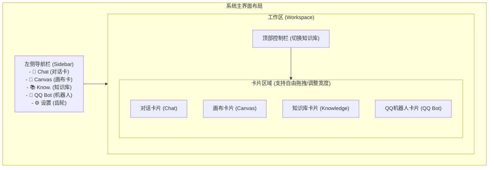
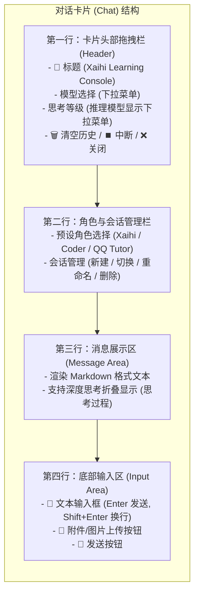
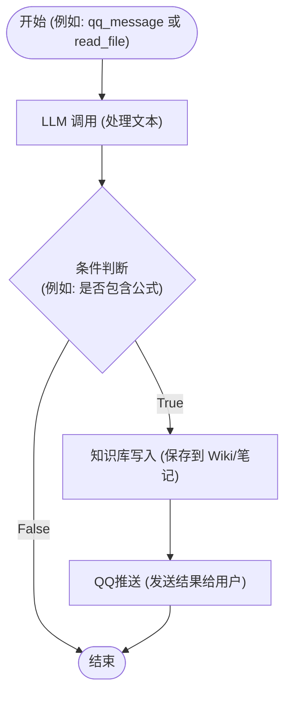
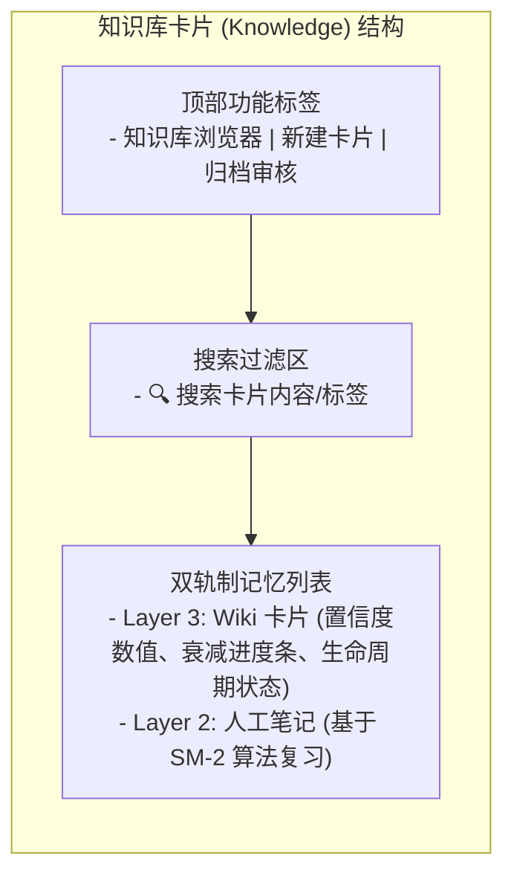

# User Manual Improvements Design Document

**Date:** 2026-06-13  
**Topic:** Supplement USER_MANUAL.md content, fix diagrams using Mermaid, and standardize styling/formatting.

---

## 1. Diagrams Redesign (using Mermaid)

All layout and workflow diagrams will be converted to Mermaid charts to prevent monospace font alignment issues with Chinese characters and emojis.

### 1.1 Main Interface Layout

### 1.2 ChatCard UI Structure

### 1.3 Canvas Workflow Logic

### 1.4 Knowledge Card Structure

---

## 2. Text Content Updates

### 2.1 Chat Card
- Update **Section 2.2** layout description.
- Update **Section 2.6** model select description (dropdown inside header, thinking level dropdown conditional visibility and states: `off`, `minimal`, `low`, `medium`, `high`, `xhigh`).
- Update **Section 2.7** visual model processing details (automatic fallback to visual model for description extraction).

### 2.2 Canvas Card
- Update **Section 3.4** editing actions with hover delete button, keyboard **Delete** key shortcut, and **Ctrl + D** node copy shortcut.
- Update **Section 3.6** validation criteria list.

### 2.3 Knowledge Card
- Update **Section 4.1 & 4.3** with description of Wiki card Markdown formatting (tables, code blocks, lists, quotes, styled bold/links).

### 2.4 Settings Panel (Section 6)
- Remove active model selection from Settings Panel text (Section 6.4).
- Add details on Switch Toggles for providers & models.
- Add details on Key validation checking ("未配置 Key" and "已禁用" status badges).
- Add details on adding models inline (+ 添加模型) and deleting models inline.
- Add details on custom provider wizard (+ 添加自定义服务商).
- Add details on default provider deletion and restoration (Restore button).
- Note that OpenRouter has been removed as a default provider.

---

## 3. Formatting Standards
- Standardize heading levels.
- Fix spacing between Chinese and English text (e.g., "API Key" instead of "APIKey", "Chat 卡" instead of "Chat卡").
- Format tables, code blocks, and warning alerts consistently.
