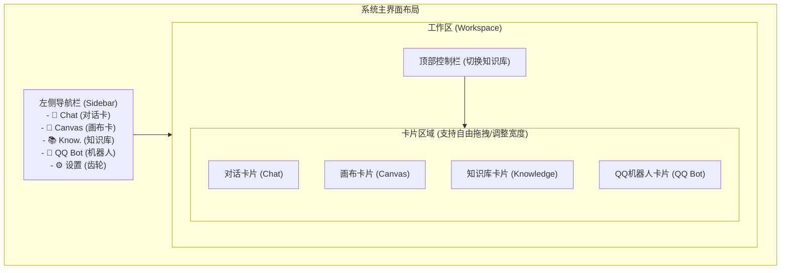
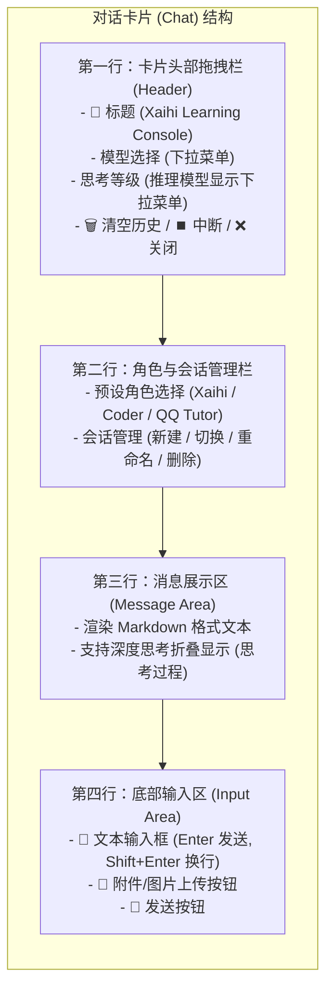
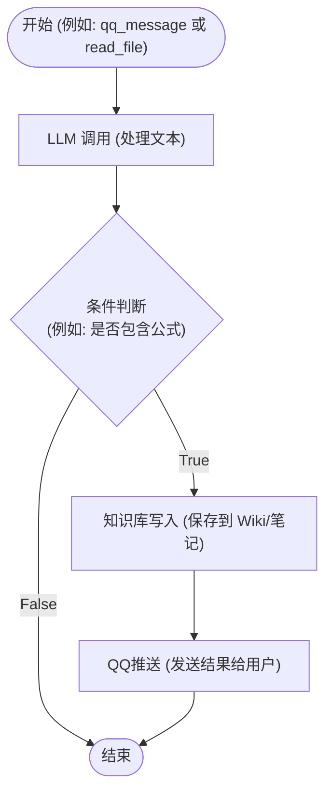
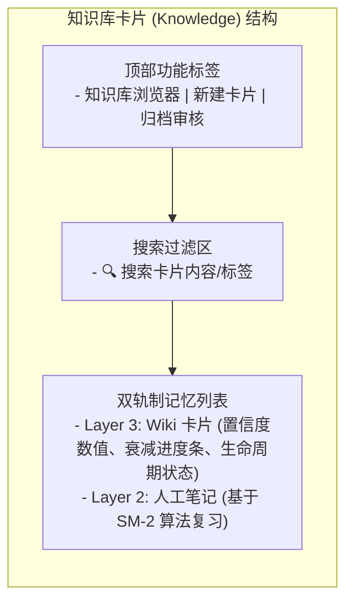

# User Manual Improvements Implementation Plan

> **For Antigravity:** REQUIRED WORKFLOW: Use `.agent/workflows/execute-plan.md` to execute this plan in single-flow mode.

**Goal:** Supplement USER_MANUAL.md with the latest refactored features, replace outdated ASCII diagrams with Mermaid charts, and standardize formatting.

**Architecture:** We will systematically update the Markdown file section by section. Outdated ASCII wireframes will be replaced with clean, modern Mermaid diagrams. Subsections will be rewritten to accurately reflect recent Settings Panel and ChatCard header changes.

**Tech Stack:** Markdown, Mermaid

---

### Task 1: Update Section 1 (Quick Start & Layout)

**Files:**
- Modify: `USER_MANUAL.md`

**Step 1: Check Section 1 baseline**
Read lines 1 to 127 in `USER_MANUAL.md` to locate the ASCII diagram in Section 1.6.

**Step 2: Replace ASCII diagram with Mermaid layout chart**
Replace the ASCII diagram in Section 1.6 (lines 105-120) with:


**Step 3: Verify Section 1 changes**
Ensure the layout sections render clean text and the Mermaid block compiles with no syntax errors.

**Step 4: Commit**
```bash
git add USER_MANUAL.md
git commit -m "docs: update section 1 layout diagram in USER_MANUAL.md"
```

---

### Task 2: Update Section 2 (Chat Console)

**Files:**
- Modify: `USER_MANUAL.md`

**Step 1: Locate Section 2 details**
Read lines 128 to 227 in `USER_MANUAL.md` to locate Section 2.2 and Section 2.6.

**Step 2: Update Section 2.2 UI structure and 2.6 model selection text**
1. Replace Section 2.2 ASCII diagram with:

2. Rewrite Section 2.6:
- Instruct users to select the active model directly in the dropdown within the ChatCard header.
- Explain the conditional reasoning selector (`off`/`minimal`/`low`/`medium`/`high`/`xhigh`), which appears only when the selected model supports reasoning.
3. Update Section 2.7 with automatic vision processing description.

**Step 3: Verify Section 2 changes**
Confirm model selection instructions match the actual frontend code.

**Step 4: Commit**
```bash
git add USER_MANUAL.md
git commit -m "docs: update chat card model selector and structure in USER_MANUAL.md"
```

---

### Task 3: Update Section 3 (Workflow Canvas)

**Files:**
- Modify: `USER_MANUAL.md`

**Step 1: Check Section 3 baseline**
Read lines 228 to 331 in `USER_MANUAL.md` to locate the flow diagram in Section 3.2.

**Step 2: Replace ASCII diagram and update shortcuts**
1. Replace Section 3.2 ASCII diagram with:

2. Update Section 3.4: Add hover delete button description and keyboard **Delete** key shortcut. Add **Ctrl + D** node duplicate shortcut.
3. Update Section 3.6: Supplement validation check details (type mismatch, unreachable nodes, missing parameters, infinite loop check).

**Step 3: Verify Section 3 changes**
Check that the flow logic and keyboard shortcuts are documented accurately.

**Step 4: Commit**
```bash
git add USER_MANUAL.md
git commit -m "docs: update canvas workflows and shortcuts in USER_MANUAL.md"
```

---

### Task 4: Update Section 4 (Knowledge Base)

**Files:**
- Modify: `USER_MANUAL.md`

**Step 1: Check Section 4 baseline**
Read lines 332 to 449 in `USER_MANUAL.md` to locate the diagram in Section 4.2.

**Step 2: Replace ASCII diagram and document Markdown support**
1. Replace Section 4.2 ASCII diagram with:

2. Update Section 4.1 & 4.3: Document the Markdown rendering support in Wiki Cards (tables, code blocks, lists, quotes, styled bold/links).

**Step 3: Verify Section 4 changes**
Verify that GFM rendering details are accurate in the wiki description.

**Step 4: Commit**
```bash
git add USER_MANUAL.md
git commit -m "docs: update knowledge base UI diagram and markdown details in USER_MANUAL.md"
```

---

### Task 5: Rewrite Section 6 (System Settings)

**Files:**
- Modify: `USER_MANUAL.md`

**Step 1: Locate Section 6 details**
Read lines 537 to 577 in `USER_MANUAL.md`.

**Step 2: Rewrite Section 6**
Replace Section 6 completely to cover:
- Active model configuration has moved to ChatCard header.
- Switch toggles for enabling/disabling providers and models.
- Key presence checking ("未配置 Key" and "已禁用" badges).
- Collapsible model list display.
- Adding and deleting individual models inline.
- Custom provider creation via form modal.
- Built-in provider deletion and restoration.
- Note that OpenRouter has been removed as a default provider.

**Step 3: Verify Section 6 changes**
Double check settings panel descriptions against `SettingsPanel.tsx`.

**Step 4: Commit**
```bash
git add USER_MANUAL.md
git commit -m "docs: rewrite system settings section in USER_MANUAL.md"
```

---

### Task 6: Final Review & Formatting Pass

**Files:**
- Modify: `USER_MANUAL.md`

**Step 1: Standardize formatting**
Check heading levels, standard spacing between Chinese and English text, list styles, and tables. Ensure no leftover broken ASCII art lines exist.

**Step 2: Run verification**
Read the final file structure and run the project build to ensure no regression or errors.

**Step 3: Commit**
```bash
git add USER_MANUAL.md
git commit -m "docs: complete final formatting pass on USER_MANUAL.md"
```
